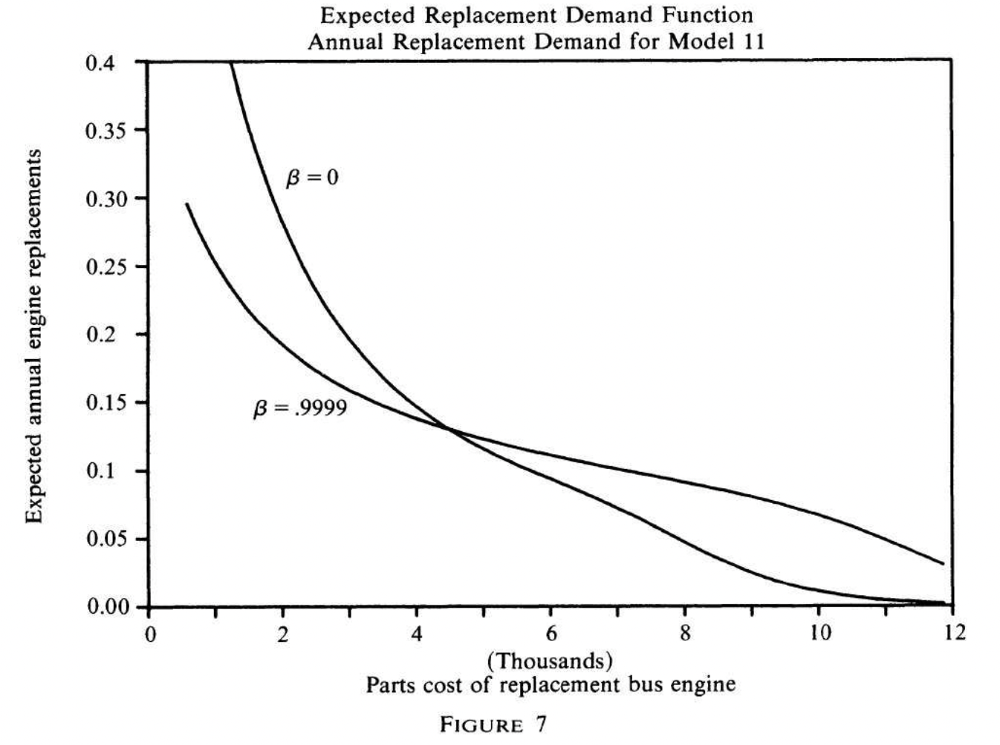

## Introduction

### Motivation

**IO**: role of *market structure* on *equilibrium outcomes*.

**Dynamics**: study the **endogenous evolution** of *market structure*.

- **Supply** side dynamics
  - Irreversible investment
  - Entry sunk costs
  - Product repositioning costs
  - Price adjustment costs
  - Learning by doing
- **Demand** side dynamics
  - Switching costs
  - Durable or storable products

**Bonus motivation**: AI literature studies essentially the same set of problems with similar tools [@igami2020artificial]

- Irony: niche topic in IO (super niche in econ), but at the core of the frontier in computer science
  - Why? Computation is hard, estimation harder, but extremely powerful prediction tool 
  - The world is intrinsecally dynamic

### Examples (1)

Some examples in empirical IO

-   **Investment**
    -   @rust1987optimal: bus engine replacement decision
    
-   **Durable goods**
    -   @gowrisankaran2012dynamics: consumer demand in the digital camcorder industry
-   **Stockpiling**
    -   @erdem2003brand: promotions and stockpiling of ketchup
    -   @hendel2006measuring: stockpiling of laundry detergents
-   **Learning**
    -   @erdem1996decision: brand learning in the laundry detergent industry
    -   @crawford2005uncertainty: demand learning of anti‐ulcer drug prescriptions
-   **Switching costs**
    -   @handel2013adverse: inertia in demand for health insurance

### Examples (2)

But also in other applied micro fields:

-   **Labor economics**
    -   Should you go to college? [@keane1997career]
    
-   **Health economics**
    -   Which health insurance to pick given there are switching costs?
        [@handel2013adverse]
    
    -   Addiction [@becker1988theory]
    
-   **Public finance**
    -   How should you set optimal taxes in a dynamic environment?
        [@golosov2006new]

### Do we really need dynamics?

In some cases, we can **reduce** a dynamic problem to a:

1.  Static problem
2.  Reduced-form problem

E.g., Investment decision

-   Dynamic problem, as gains are realized after costs

-   "Static" solution: invest if $\mathbb E (NPV ) > TC$

-   Action today ($a_t=0$ or $1$) does not affect the amount of future payoffs (NPV)

But many cases where it's hard to evaluate dynamic questions in a static/reduced-form setting.

-   Typically, cases where decision today would affect payoffs tomorrow
-   And you care about those payoffs ($\neq$ myopia)

> "*A dynamic model can do anything a static model can.*"

### New Empirical IO

So-called New Empirical IO (summary in @bresnahan1989empirical)

- Some **decisions today** might affect **payoffs tomorrow**
- But the decision today depends on the **state today**
- And the state today might have been the result of a **decision yesterday** 
- Etc...
- Need **dynamics** to study these questions
- Where does it all start?
  - @pakes1986patents
  - @berry1992estimation

### Pros and Cons

**Advantages**

-   We can adress **intertemporal trade-offs**
    -   Flow vs stock stocks and benefits

-   We can examine **transitions** and not only steady states
-   We are able to address **policy questions** that cannot be addressed with reduced-form methods

    -   Standard advantage of structural estimation
    -   But in a context with relevant intertemporal trade-offs / decisions

**Disadvantages**

-   We typically need more **assumptions**

    -   Robustness testing will therefore be important

-   **Identification** in dynamic models is less transparent
    -   Thus time should be spent articulating what variation in the
        data identifies our parameters of interest)

-   It is often **computationally intensive** (i.e., slow / unfeasible)

### From Statics to Dynamics

Typical steps

1. Specify the primitives of the model
   - **Static**: single period agents’ payoff functions (utility or profit)
   - **Dynamic**: static payoffs + *evolution of state variables*
     - Can be exogenous
     - ... or endogenous: decision today has an effect on the state tomorrow
2. Solve for optimal behavior
   - **Static**: tipically agents maximize current utility or profit
   - **Dynamic**: agents maximize *present discounted value* of future utilities or profits 
3. Search for parameter values that result in the “best match” between our model predictions and observed behavior

## 1st year Macro Recap

### Markov Decision Processes

Formally, a discrete-time MDP consists of the following **objects**

-   A discrete **time index** $t \in \lbrace 0,1,2,...,T \rbrace$, for $T \leq \infty$
    
- A **state space** $\mathcal S$

- An **action space** $\mathcal A$

  -   and a family of **constraint sets** $\lbrace \mathcal a_t(s_t) \subseteq \mathcal A \rbrace$

- A family of **transition probabilities** $\lbrace \Pr_{t}(s_{t+1}|s_t,a_t) \rbrace$

- A **discount factor**, $\beta$

- A family of single-period **reward functions** $\lbrace (u_t(s_t,a_t) \rbrace$ 

  - so that the utility functional $U$ has an additively separable decomposition 
    $$
    U(\boldsymbol s, \boldsymbol a) = \sum_{t=0}^{T} \beta^{t} u_{t}\left(s_t, a_{t}\right)
    $$

### MDP (2)

In words

- The **state space** $\mathcal S$ contains all the information needed to

  - compute static utilities $u_t (s_t, a_t)$
  - compute transition probabilities $\lbrace \Pr_{t} (s_{t+1}|s_t,a_t) \rbrace$

- The (conditional) **action space** $\mathcal A (s_t)$ contains all the actions available in state $s_t$

  - How can it be different by state? E.g. entry/exit decision if you're in/out of the market

- The **transition probabilities** $\lbrace \Pr_{t+1}(s_{t+1}|s_t,a_t) \rbrace$ define the probabilities of future states $s_{t+1}$ conditional on

  - Present state $s_t$
  - Present decision $a_t$

- The **discount factor** $\beta$ together with the static **reward functions** $\lbrace (u_t(s_t,a_t) \rbrace$ determines the **objective function**
  $$
  \mathbb E_{\boldsymbol s'} \Bigg[ \sum_{t=0}^{T} \beta^{t} u_{t}\left(s_t, a_{t}\right) \Bigg]
  $$

### Notation

Brief parenthesis on notation

- I have seen **states** denoted as

  - $s$ (for state)
  - $x$
  - $\omega$
  - others, depending on the specific context, e.g. $e$ for experience

  **I will try to stick to $s$ all the time**

- I have seen **decisions** denoted as

  - $a$ (for action)
  - $d$ (for decision)
  - $x$ 
  - others, depending on the specific context, e.g. $i$ for investment

  **I will try to stick to $a$ all the time**

### Maximization Problem

The objective is to pick the decision rule (or **policy function**) $P = \boldsymbol a^* = \lbrace a_1^*, ..., a_t ^ * \rbrace$ that solves
$$
\max_{\boldsymbol a} \ \mathbb E_{\boldsymbol s'} \Bigg[ \sum_{t=0}^{T} \beta^{t} u_{t} \left(s_{t}, a_{t} \right) \Bigg]
$$
Where the expectation is taken over transition probabilities generated by the decision rule $\boldsymbol a$.

### Stationarity

In many applications, we assume **stationarity**

- The **transition probabilities and utility functions do not directly depend on** $t$ 

  - i.e., are the same for all $t$ 
    - $\Pr_{{\color{red}{t}}} (s_{t+1}|s_t,a_t) \  \to \ \Pr(s_{t+1}|s_t,a_t)$
    - $u_{{\color{red}{t}}} (s_t,a_t) \ \to \ u(s_t,a_t)$
- **Uncomfortable assumption?**
- You think there is some reason (variable) why today's probabilities should be different from tomorrow's?
  - If **observable**, include that variable in the state space
  - If **unobservable**, integrate it out
  

### Stationarity (2)

- In the **finite horizon** case ($T \leq \infty$), stationarity does not help much 

  - $\sum_{t=0}^{T} \beta^{t} u(s_t, a_{t})$ still depends on $t$, conditional on $s_t$
  - Why? Difference between $t$ and $T$ matters in the sum
- In **infinite-horizon** problems, stationarity helps **a lot**

  - Now the difference between $t$ and $T$ is always the same, i.e. $\infty$
  - $\sum_{t=0}^{\infty} \beta^{t} u(s_t, a_{t})$ does **not** depend on $t$, conditional on $s_t$

  - *The future looks the same whether the agent is in state $s_t$ at time $t$ or in state $s_{t+\tau} = s_t$ at time $t + \tau$* 

### Value Function

Consider a **stationary infinite-horizon** problem

- The only variable which affects the agent’s view about the future is the current value of the state, $s_t$

- We can rewrite the **agent's problem** as
  $$
  V_0(s_0) = \max_{\boldsymbol a} \ \mathbb E_{\boldsymbol s'} \Bigg[ \sum_{t=0}^{\infty} \beta^{t} u\left(s_t, a_{t}\right) \Bigg]
  $$
  where

  - $a_t \in \mathcal A(s_t) \ \forall t$
  - The expectation is taken over future states $\boldsymbol s'$
    - that evolve according to $\lbrace \Pr(s_{t+1}|s_t,a_t) \rbrace$
  - $V(\cdot)$ is called the **value function**

### How to solve?

- One could try to solve it by **brute force**
  - i.e. try to solve for the structure of all of the optimal decisions, $\boldsymbol a^*$
  - Indeed, for finite-horizon problems, that might be necessary
- For **stationary infinite-horizon** problems, the value and policy function should be **time invariant**
  - $V_{\color{red}{t}} (s_t) = V(s_t)$ 
  - $P_{\color{red}{t}} (s_t) = P(s_t)$
- What do we gain?

### Bellman Equation

$$
\begin{align}
V(s_0) &= \max_{\boldsymbol a} \ \mathbb E_{\boldsymbol s'} \Bigg[ \sum_{t=0}^{\infty} \beta^{t} u(s_t, a_{t}) \Bigg] 
= \newline
&= \max_{\boldsymbol a} \ \mathbb E_{\boldsymbol s'} \Bigg[ {\color{red}{u(s_{0}, a_{0})}} + \sum_{{\color{red}{t=1}}}^{\infty} \beta^{t} u(s_t, a_{t}) \Bigg] 
= \newline
&= \max_{\boldsymbol a} \ \Bigg\lbrace u(s_{0}, a_{0}) + {\color{red}{\mathbb E_{\boldsymbol s'}}} \Bigg[ \sum_{t=1}^{\infty} \beta^{t} u(s_t, a_{t}) \Bigg] \Bigg\rbrace 
= \newline
&= \max_{\boldsymbol a} \ \Bigg\lbrace u(s_{0}, a_{0}) + {\color{red}{\beta}} \ \mathbb E_{\boldsymbol s'} \Bigg[ \sum_{t=1}^{\infty} \beta^{{\color{red}{t-1}}} u(s_t, a_{t}) \Bigg] \Bigg\rbrace 
= \newline
&= \max_{{\color{red}{a_0}}} \ \Bigg\lbrace u(s_{0}, a_{0}) + \beta \ {\color{red}{\max_{\boldsymbol a}}}\ \mathbb E_{\boldsymbol s'} \Bigg[ \sum_{t=1}^{\infty} \beta^{t-1} u(s_t, a_{t}) \Bigg] \Bigg\rbrace 
= \newline
&= \max_{a_0} \ \Bigg\lbrace u(s_{0}, a_{0}) + \beta \ {\color{red}{\int V(s_1) \Pr(s_1 | s_0, a_0)}} \Bigg\rbrace
\end{align}
$$

 

### Bellman Equation (2)

We have now a **recursive formulation** of the value function:  the **Bellman Equation**
$$
{\color{red}{V(s_0)}} = \max_{a_0} \ \Bigg\lbrace u(s_{0}, a_{0}) + \beta \ \int {\color{red}{V(s_1)}} \Pr(s_1 | s_0, a_0) \Bigg\rbrace
$$
**Intuition**

- The Bellman Equation is a **functional equation**
  - Has to be satisfied in every state
  - Can be written as ${\color{red}{V}} = T({\color{red}{V}})$
  - We are actually looking for a **fixed point** of $T$

The decision rule that satisfies the Bellman Equation is called the **policy function**
$$
a(s_0) =  \arg \max_{a_0} \ \Bigg\lbrace u(s_{0}, a_{0}) + \beta \ \int V(s_1) \Pr(s_1 | s_0, a_0) \Bigg\rbrace
$$

### Contractions

Under regularity conditions

- $u(s, a)$ is jointly continuous and bounded in $(s, a)$
- $\mathcal A (s)$ is a continuous correspondence

It is possible to show that 
$$
T(W)(s) = \max_{a \in \mathcal A(s)} \ \Bigg\lbrace u(s, a) + \beta \ \int W(s') \Pr(s' | s, a) \Bigg\rbrace
$$
is a **contraction mapping** of modulus $\beta$.

- **Contraction Mapping Theorem**: then $T$ has a unique fixed point!

### Solving for the Value Function

How do we actually do it in practice?

- For **finite horizon** MDPs: **backward induction**
  - Start from the last period: static maximization problem
  - Move backwards taking the future value as given
- For **infinite horizon** MDPs: different options
  - **value function iteration**
    - most common
  - policy function iteration
  - successive approximations

### Difference with 1st year Macro

So what's going to be new here?

1. **Estimation**: retrieve model primitives from observed behavior
   - And related: uncertainty
2. **Strategic interaction**: multiple agents taking dynamic decisions
   - Next lecture

## Rust (1987)

### Setting

@rust1987optimal: *An Empirical Model of Harold Zurcher*

-   Harold Zurcher (HZ) is the city bus superintendant in Madison, WI
-   As bus engines get older, the probability of malfunctions increases
-   HZ decides when to replace old bus engines with new ones

    -   Optimal stopping / investment problem
-   **Tradeoff**

    -   Cost of a new engine (fixed, stock)
    -   Repair costs, because of engine failures (continuous, flow)
-   Do we care about Harold Zurcher?
    -   Obviously not (and neither did Rust), it's a method paper
    -   But referee asked for an application

### Data

**Units of observation**

- Rust observes 162 buses over time

**Observables**: for each bus, he sees 

- monthly mileage (RHS, state variable) 
- and whether the engine was replaced (LHS, choice variable), 
- in a given month

**Variation**

- on average, bus engines were replaced every 5 years with over 200,000 elapsed miles 
- considerable variation in the *time* and *mileage* at which replacement occurs

### Idea

- Construct a (parametric) **model** which predicts the time and mileage at which engine replacement occurs
- Use the model predictions (conditional on parameter values) to **estimate parameters** that “fit” the data
  - **predicted** replacements, given mileage VS **observed** replacements, given mileage
- Ideally use the estimates to **learn something** new
  - e.g. the correct *dynamic* demand curve for bus engine replacement

### Static Alternative

What would you do otherwise?

- You observe replacement decisions
- ... and replacement costs 
- $\to$ **Regress** replacement decision on replacement costs

**Problem**

- Replacement benefits are a flow (lower maintenance costs)
- ... while the cost is a stock

**Outcome**

- We expect the *overestimate* demand elasticity. Why?
- Overpredict substitutions at low costs
- and underpredict substitution at high cost

### Model

Assumptions of the structural model

- **State**: $s_t \in \lbrace 0, ... , s_{max} \rbrace$ 
  - engine accumulated mileage at time $t$
  - **Note**: "continuous" in the data but has to be discretized into bins
- **Action**: $a_t \in \lbrace 0, 1 \rbrace$
  -  replace engine at time $t$
- **State transitions**: $\Pr ( s_{t+1} | s_{0}, ... , s_t ; \theta)= \Pr (s_{t+1} | s_t ; \theta )$
  - mileage $s_t$ evolves exogenously according to a 1st-order Markov process
  - The transition function is the same for every bus.
  - If HZ replaces in period $t$ ($a_t = 1$), then $s_t = 0$

### Model (2)

HZ **static utility function** (for a single bus)
$$
u\left(s_t, a_{t} ; \theta\right)= \begin{cases}-c\left(s_t ; \theta\right) & \text { if } a_{t}=0 \text { (not replace) } \newline -R-c(0 ; \theta) & \text { if } a_{t}=1 \text { (replace) }\end{cases}
$$
where

- $c(s_t ; \theta)$: expected **costs of operating** a bus with mileage $s_t$ 
  - ​	including maintenance costs & social costs of breakdown
  - We would expect $\frac{\partial c}{\partial s}>0$
  
- $R$ is the **cost of replacement** (i.e., a new engine)
  - Note that replacement occurs immediately
- $u(s_t , a_t ; \theta)$: expected current utility from operating a bus with mileage $s_t$ and making replacement decision $a_t$

### Model (3)

HZ **objective function** is to maximize the expected present discounted sum of future utilities
$$
V(s_t ; \theta) = \max_{\boldsymbol a} \mathbb E_{s_{t+1}} \left[\sum_{\tau=t}^{\infty} \beta^{\tau-t} u\left(s_{\tau}, a_{\tau} ; \theta\right) \ \Bigg| \ s_t, \boldsymbol a ; \theta\right]
$$
where

- The expectation $\mathbb E$ is over future $x$, which evolve according to Markov process 
- $\max$ is over future choices $a_{t+1}, ... ,a_{\infty}$, 
  - because HZ will observe future states $s_{\tau}$ before choosing future actions $a_\tau$, this is a functional

**Notes**

- This is for one bus (but multiple engines).
- HZ has an infinite horizon for his decision making
- $s_t$ summarizes state at time $t$, i.e., the expected value of future utilities only depends on $s_t$

### Bellman Equation

This (sequential) representation of HZ's problem is very cumbersome to work with.

We can rewrite $V (s_t; \theta)$ with the following Bellman equation
$$
V\left(s_t ; \theta\right) = \max_{a_{t}} \Bigg\lbrace u\left(s_t, a_{t} ; \theta\right)+\beta \mathbb E_{s_{t+1}} \Big[V\left(s_{t+1} ; \theta\right) \Big| s_t, a_{t} ; \theta\Big] \Bigg\rbrace
$$
Basically we are dividing the infinite sum (in the sequential form) into a present component and a future component.

Notes:

- Same $V$ on both sides of equation because of infinite horizon - the future looks the same as the present for a given $s$ (i.e., it doesn't matter where you are in time).
- The expectation $\mathbb E$ is over the state-transition probabilities, $\Pr (s_{t+1} | s_t, a_t ; \theta)$

### Order of Markow Process

Suppose for a moment that $s_t$ follows a second-order markov process
$$
s_{t+1}=f\left(s_t, {\color{red}{s_{t-1}}}, \varepsilon ; \theta\right)
$$
Now $s_t$ is not sufficient to describe current $V$ 

- We need both $s_t$ and $s_{t-1}$ in the state space (i.e., $V (s_t , {\color{red}{s_{t-1}}}; \theta)$ contains $s_{t-1}$, too), 
- and the expectation is over the transition probability $\Pr (s_{t+1} | s_t, {\color{red}{s_{t-1}}}, a_t ; \theta)$

### Parenthesis: State Variables

Which variables should be state variables? I.e. should be included in the state space?

**General rule** for 1st order markow processes: variables need to

- define expected current payoff, **and**
- define expectations over next period state (i.e., distribution of $s_{t+1}$)

What do you do otherwise? Integrate them out! **Examples**

- Weather affects static utitilies but not transition probabilities
  - More annoying to replace the engine if it rains
  - Integration means: *"compute expected utility of Harold Zurcher before he opens the window"*
- Month of the year affects transition probabilities but not utilities
  - Buses are used more in the winter
  - Integration means: *"compute average transition probabilities over months"* 

> **Note**: you can always get the non-expected value function if you know the probability of raining or the transition probabilities by month

### Policy Function

Along with this value function comes a corresponding **policy (or choice) function** mapping the state $s_t$ into HZ's optimal replacement choice $a_t$
$$
P \left(s_t ; \theta\right) =  \max_{a_{t}} \Bigg\lbrace u\left(s_t, a_{t} ; \theta\right) + \beta \mathbb E_{s_{t+1}} \Big[ V \left(s_{t+1} ; \theta\right) \Big| s_t, a_{t} ; \theta\Big] \Bigg\rbrace
$$
Given $\frac{\partial c}{\partial s}>0$, the policy function has the form
$$
P \left(s_t ; \theta\right) =  \begin{cases}1 & \text { if } s_t \geq \gamma(\theta) \newline 0 & \text { if } s_t<\gamma(\theta)\end{cases}
$$
where $\gamma$ is the replacement mileage.

How would this compare with the optimal replacement mileage if HZ was myopic?

- Answer: HZ would wait until $R \leq c(s)$ for the replacement action

### Solving the Model

Why do we want to solve for the value and policy functions?

- We want to know the agent's optimal behavior and the equilibrium outcomes
- and be able to conduct comparative statics/dynamics (a.k.a. counterfactual simulations)

We have the **Bellman Equation**
$$
V\left(s_t ; \theta\right) = \max_{a_{t}} \Bigg\lbrace u\left(s_t, a_{t} ; \theta\right)+\beta \mathbb E_{s_{t+1}} \Big[V\left(s_{t+1} ; \theta\right) \ \Big| 
\ s_t, a_{t} ; \theta\Big] \Bigg\rbrace
$$
Which we can compactly write as
$$
V\left(s_t ; \theta\right) = T \Big( V\left(s_{t+1} ; \theta\right) \Big)
$$
**Blackwell's Theorem**: under regularity conditions, $T$ is a contraction mapping with modulus $\beta$.

**Contraction Mapping Theorem**: $T$ has a fixed point and we can find it by iterating $T$ from any starting value $V^{(0)}$.

### Value Function Iteration

What does **Blackwell's Theorem** allow us to do?

1. Start with any arbitrary function $V^{(0)}(\cdot)$
2. Apply the mapping $T$ to get $V^{(1)}(\cdot) = T (V^{(0)}(\cdot))$
3. Apply again $V^{(2)}(\cdot) = T (V^{(1)}(\cdot))$
4. Continue applying $T$ , and $V^{(k)}$ will converge to the unique fixed point of $T$
   - i.e., the true value function $V(s_t; \theta)$
5. Once we have $V(s_t; \theta)$, it's fairly trivial to compute the policy function $P(s_t; \theta)$
   - Static optimization problem (given $V$)

This process is called **value function iteration**

### How to Reconcile Model and Data?

**Ideal Estimation Routine**

1. Pick a parameter value $\theta$
2. Solve value and policy function (*inner loop*)
3. Match *predicted choices* with *observed choices*
4. Find the parameter value $\hat \theta$ that best fits the data (*outer loop*)
   - Makes the observed choices "closest" to the predicted choices
   - (or maximizes the likelihood of the observed choices)

**Issue**: model easily **rejected** by the data

- The policy function takes the the form: replace iff $s_t \geq \gamma(\theta)$

- Can't explain the coexistence of e.g. "*a bus without replacement at 22K miles*" and "*another bus being replaced at 17K mile*s" in the data

- We need some **unobservables** in the model to explain why observed choices do not exactly match predicted choices

  

## Rust (1987) - Estimation

### Uncertainty

How can we explain different replacement actions at different mileages in the data?

1. Add other observables
2. **Add some stochastic element**

But **where**? Two options

1. Randomness in decisions
   - I.e. *"Harold Zurcher sometimes would like to replace the bus engine but he forgets"*
   - Probably still falsifiable
   - Also need "*Harold Zurcher sometimes would like not to replace but replacement happens"* 🤔🤔🤔
2. Randomness in the state
   - Harold Zurcher knows something that we don't
   - He **always makes the optimal decision** but based on somethig we don't observe

### Unobservables

Rust uses the following **utility specification**:
$$
u\left(s_t, a_{t}, {\color{red}{\epsilon_{t}}} ; \theta\right) = u\left(s_t, a_{t} ; \theta\right) + {\color{red}{\epsilon_{a_{t} t}}} = \begin{cases} - c\left(s_t ; \theta\right) + {\color{red}{\epsilon_{0 t}}} & \text { if } \ a_{t}=0 \newline \newline -R-c(0 ; \theta) + {\color{red}{\epsilon_{1 t}}} & \text { if } \ a_{t}=1 \end{cases}
$$

- The $\epsilon_{it}$ are components of utility of alternative $a$ that are observed by HZ but not by us, the econometrician.
  - E.g., the fact that an engine is running unusually smoothly given its mileage, 
  - or the fact that HZ is sick and doesn't feel like replacing the engine this month
- **Note**: we have assumed addictive separability of $\epsilon$
- The $\epsilon_a$s also affect HZ's replacement decision
- $\epsilon_{it}$ are **both observed and relevant** $\to$ part of the state space

>  Can we still **solve** the model? Can we **estimate** it?

### Unobservables (2)

The **Bellman Equation** becomes
$$
V \Big( {\color{red}{ \lbrace s_\tau \rbrace_{\tau=1}^t , \lbrace \epsilon_\tau \rbrace_{\tau=1}^t }} ; \theta \Big) = \max_{a_{t}} \Bigg\lbrace u\left(s_t, a_{t} ; \theta\right) + {\color{red}{\epsilon_{it}}} + \beta \mathbb E_{s_{t+1}, {\color{red}{\epsilon_{t+1}}}} \Big[V\left(s_{t+1}, {\color{red}{\epsilon_{it+1}}} ; \theta\right) \ \Big| 
\ {\color{red}{ \lbrace s_\tau \rbrace_{\tau=1}^t , \lbrace \epsilon_\tau \rbrace_{\tau=1}^t }}, a_{t} ; \theta\Big] \Bigg\rbrace
$$
**Issues**

- The problem is **not Markow** anymore
  - Is $\epsilon_t$ correlated with $\epsilon_{t-\tau}$? How?
  - Is $\epsilon_t$ correlated with $s_t$? And $s_{t-\tau}$? How?
- Dimension of the **state space** has increased
  - From $k = (k \text{ points})^{1 \text{ variable} \times 1 \text{ period}}$ points, to $\infty = (k \text{ points})^{3 \text{ variables} \times \infty \text{ periods}}$  🤯🤯
  - Assuming all variables assume $k$ values
- Number of variables to integrate over to compute **expectation** $\mathbb E$ has increased
  - From one variable, $s$, to three, $(s, \epsilon_{0}, \epsilon_{1})$

### Assumptions

Rust makes **4 assumptions** to make the problem tractable:

1. First order Markow process of $\epsilon$
2. Conditional independence of $\epsilon_t | s_t$ from $\epsilon_{t-1}$ and $s_{t-1}$ 
3. Independence of $\epsilon_t$ from $s_t$
4. Logit distribution of $\epsilon$

### Assumption 1

**A1**: first-order markov process of $\epsilon$
$$
\Pr \Big(s_{t+1}, \epsilon_{t+1} \Big| s_{1}, ..., s_t, \epsilon_{1}, ..., \epsilon_{t}, a_{t} ; \theta\Big) = \Pr \Big(s_{t+1}, \epsilon_{t+1} \Big| s_t, \epsilon_{t}, a_{t} ; \theta \Big)
$$

- **What it buys**
  - $s$ and $\epsilon$ prior to current period are irrelevant
- **What it still allows**:
  - allows $s_t$ to be correlated with $\epsilon_t$
- **What are we assuming away**
  
  - Any sort of longer run dependence 
  - Does it matter? If yes, just re-consider what is one time period
  - Or make the state space larger (as usual in Markow processes)

### Assumption 1 - Implications

The Bellman Equation becomes
$$
V\left(s_t, {\color{red}{\epsilon_{t}}} ; \theta\right) = \max_{a_{t}} \Bigg\lbrace u\left(s_t, a_{t} ; \theta\right) + {\color{red}{\epsilon_{a_{t} t}}} + \beta \mathbb E_{s_{t+1}, {\color{red}{\epsilon_{t+1}}}} \Big[V(s_{t+1}, {\color{red}{\epsilon_{t+1}}} ; \theta) \ \Big| \ s_t, a_{t}, {\color{red}{\epsilon_{t}}} ; \theta \Big] \Bigg\rbrace
$$

- Now the **state** is $(s_t, \epsilon_t)$
  - sufficient, because defines both current utility and (the expectation of) next-period state, under the first-order Markov assumption
  - $\epsilon_t$ is now analogous to $s_t$
  - State space now is  $k^3 = (k \text{ points})^{3 \text{ variables} \times 1 \text{ period}}$ 
    - From $\infty = (k \text{ points})^{3 \text{ variables} \times \infty \text{ periods}}$ 
- Now we could use **value function iteration** to solve the problem
  - If $\epsilon_t$ is continuous, it has to be discretised

### Assumption 1 - Issues

**Open issues**

1. **Curse of dimensionality in the state space**: ($s_t, \epsilon_{0t}, \epsilon_{1t}$)

   - Before, there were $k$ points in state space (discrete values of $x$) 
   - Now there are $k^3$ : $k$ each for $s$, $\epsilon_0$, $\epsilon_1$
     - (Assuming we discretize all state variables into $k$ values)
   - Generally, number of points in state space (and thus computational time) increases exponentially in the number of variables

2. **Curse of dimensionality in the expected value**: $\mathbb E_{s_{t+1}, \epsilon_{0,t+1}, \epsilon_{1,t+1}}$

   - For each point in state space (at each iteration of the contraction mapping), need to compute

   $$
   \mathbb E_{s_{t+1}, \epsilon_{t+1}} \Big[V (s_{t+1}, \epsilon_{t+1} ; \theta) \ \Big|  \ s_t, a_{t}, \epsilon_{t} ; \theta \Big]
   $$

   - Before, this was a 1-dimensional integral (or sum), now it's 3-dimensional

3. **Initial conditions**

### Assumption 2

**A2**: conditional independence of $\epsilon_t | s_t$ from $\epsilon_{t-1}$ and $s_{t-1}$ 
$$
\Pr \Big(s_{t+1}, \epsilon_{t+1} \Big| s_t, \epsilon_{t}, a_{t} ; \theta \Big) = \Pr \Big( \epsilon_{t+1} \Big| s_{t+1} ; \theta \Big) \Pr \Big( s_{t+1} \Big| s_t, a_{t} ; \theta \Big)
$$

- **What it buys**
  - $s_{t+1}$ is independent of $\epsilon_t$
  - $\epsilon_{t+1}$ is independent of $\epsilon_t$ and $s_t$, conditional on $s_{t+1}$
- **What it still allows**:
  - $\epsilon$ can be correlated across time, but only through the $s$ process
- **What are we assuming away**
  
  - Any time of persistent heterogeneity
  - Does it matter? Easily yes
  - There are tons of applications where the unobservables are either fixed or correlated over time
  
    - If fixed, there are methods to handle unobserved heterogeneity (i.e. bus "types")

### Assumption 2 - Implications

The Bellman Equation is
$$
V\left(s_t, {\color{red}{\epsilon_{t}}} ; \theta\right) = \max_{a_{t}} \Bigg\lbrace u\left(s_t, a_{t} ; \theta\right) + {\color{red}{\epsilon_{a_{t} t}}} + \beta \mathbb E_{s_{t+1}, {\color{red}{\epsilon_{t+1}}}} \Big[V (s_{t+1}, {\color{red}{\epsilon_{t+1}}} ; \theta) \Big| s_t, a_{t} ; \theta \Big] \Bigg\rbrace
$$

- Now $\epsilon_{t}$ is noise that **doesn't affect the future**
  - That is, conditional on $s_{t+1}$, $\epsilon_{t+1}$ is uncorrelated with $\epsilon_{t}$

> **Remeber**: if $\epsilon$ does not affect the future, it should't be in the state space! 
>
> How? Integrate it out.

### Rust Shortcut: ASV

Rust: define the **alternative-specific value function**
$$
\begin{align}
&\bar V_0 \left(s_t ; \theta\right) = u\left(s_t, 0 ; \theta\right) + \beta \mathbb E_{s_{t+1}, {\color{red}{\epsilon_{t+1}}}} \Big[V\left(s_{t+1}, {\color{red}{\epsilon_{t+1}} }; \theta\right) | s_t, a_{t}=0 ; \theta\Big] \newline
&\bar V_1 \left(s_t ; \theta\right) = u\left(s_t, 1 ; \theta\right) + \beta \mathbb E_{s_{t+1}, {\color{red}{\epsilon_{t+1}}}} \Big[V\left(s_{t+1}, {\color{red}{\epsilon_{t+1}}} ; \theta\right) | s_t, a_{t}=1 ; \theta\Big]
\end{align}
$$

- $\bar V_0 (s_t)$ is the present discounted value of not replacing, net of $\epsilon_{0t}$

- **The state does not depend on** $\epsilon_{t}$!

- What is the relationship with the value function?
  $$
  V\left(s_t, \epsilon_{t} ; \theta\right) = \max_{a_{t}} \Bigg\lbrace \begin{array}{l}
  \bar V_0 \left(s_t ; \theta\right)+\epsilon_{0 t} 
  \ ; \newline
  \bar V_1 \left(s_t ; \theta\right)+\epsilon_{1 t}
  \end{array} \Bigg\rbrace
  $$
  
- We have a 1-to-1 mapping between $V\left(s_t, \epsilon_{t} ; \theta\right)$ and $\bar V_a \left(s_t ; \theta\right)$ !

  - If we have one, we can get the other

### Rust Shortcut

Can we solve for $\bar V$? 

Yes! They have a **recursive formulation**
$$
\begin{aligned}
&
\bar V_0 \left(s_t ; \theta\right) = u\left(s_t, 0 ; \theta\right) + \beta \mathbb E_{s_{t+1}, {\color{red}{\epsilon_{t+1}}}} \Bigg[ \max_{a_{t+1}} \Bigg\lbrace \begin{array}{l}
\bar V_0 \left(s_{t+1} ; \theta\right) + {\color{red}{\epsilon_{0 t+1}}} 
\ ; \newline
\bar V_1 \left(s_{t+1} ; \theta\right) + {\color{red}{\epsilon_{1 t+1}}}
\end{array} \Bigg\rbrace \ \Bigg| \ s_t, a_{t}=0 ; \theta \Bigg] \newline
&
\bar V_1 \left(s_t ; \theta\right) = u\left(s_t, 1 ; \theta\right) + \beta \mathbb E_{s_{t+1}, {\color{red}{\epsilon_{t+1}}}} \Bigg[ \max_{a_{t+1}} \Bigg\lbrace \begin{array}{l}
\bar V_0 \left(s_{t+1} ; \theta\right) + {\color{red}{\epsilon_{0 t+1}}} 
\ ; \newline
\bar V_1 \left(s_{t+1} ; \theta\right) + {\color{red}{\epsilon_{1 t+1}}}
\end{array} \Bigg\rbrace \ \Bigg| \ s_t, a_{t}=1 ; \theta \Bigg] \newline
\end{aligned}
$$

- @rust1988maximum shows that it's a joint contraction mapping
- **Memo**: the state space now is $2k = (2 \text{ actions}) \times (k \text{ points})^{1 \text{ variables} \times 1 \text{ period}}$ 
  - instead of $3^k = (k \text{ points})^{3 \text{ variables} \times 1 \text{ period}}$
  - Much smaller!
  
- **Lesson**: any state variable that does not affect continuation values (the future) does not have to be in the "actual" state space

### Assumption 2 - Implications

We can also **split the expectation** in the alternative-specific value function
$$
\begin{aligned}
&
\bar V_0 \left(s_t ; \theta\right) = u\left(s_t, 0 ; \theta\right) + \beta \mathbb E_{s_{t+1}} \Bigg[ \mathbb E_{{\color{red}{\epsilon_{t+1}}}} \Bigg[ \max_{a_{t+1}} \Bigg\lbrace \begin{array}{l}
\bar V_0 \left(s_{t+1} ; \theta\right) + {\color{red}{\epsilon_{0 t+1}}} 
\ ; \newline
\bar V_1 \left(s_{t+1} ; \theta\right) + {\color{red}{\epsilon_{1 t+1}}}
\end{array} \Bigg\rbrace \ \Bigg| \ s_t \Bigg] \ \Bigg| \ s_t, a_{t}=0 ; \theta \Bigg] \newline
&
\bar V_1 \left(s_t ; \theta\right) = u\left(s_t, 1 ; \theta\right) + \beta \mathbb E_{s_{t+1}} \Bigg[ \mathbb E_{{\color{red}{\epsilon_{t+1}}}} \Bigg[ \max_{a_{t+1}} \Bigg\lbrace \begin{array}{l}
\bar V_0 \left(s_{t+1} ; \theta\right) + {\color{red}{\epsilon_{0 t+1}}} 
\ ; \newline
\bar V_1 \left(s_{t+1} ; \theta\right) + {\color{red}{\epsilon_{1 t+1}}}
\end{array} \Bigg\rbrace \ \Bigg| \ s_t \Bigg] \ \Bigg| \ s_t, a_{t}=1 ; \theta \Bigg] \newline
\end{aligned}
$$
This allows us to concentrate on one single term
$$
\mathbb E_{{\color{red}{\epsilon_{t+1}}}} \Bigg[ \max_{a_{t+1}} \Bigg\lbrace \begin{array}{l}
\bar V_0 \left(s_{t+1} ; \theta\right) + {\color{red}{\epsilon_{0 t+1}}} 
\ ; \newline
\bar V_1 \left(s_{t+1} ; \theta\right) + {\color{red}{\epsilon_{1 t+1}}}
\end{array} \Bigg\rbrace \ \Bigg| \ s_t \Bigg]
$$
**Open issues**

- Distribution of $\epsilon_{t+1}$ has to be simulated
- Distribution of $\epsilon_{t+1}$ depends on $s_t$

### Assumption 3

**A3**: independence of $\epsilon_t$ from $s_t$
$$
\Pr \Big( \epsilon_{t+1} \Big| s_{t+1} ; \theta \Big) \Pr \Big( s_{t+1} \Big| s_t, a_{t} ; \theta \Big) = \Pr \big( \epsilon_{t+1} \big| \theta \big) \Pr \Big( s_{t+1} \Big| s_t, a_{t} ; \theta \Big)
$$

- **What it buys**

  - $\epsilon$ not correlated with anything
    $$
    \mathbb E_{{\color{red}{\epsilon_{t+1}}}} \Bigg[ \max_{a_{t+1} \in \lbrace 0, 1 \rbrace } \Bigg\lbrace \begin{array}{l}
    \bar V_0 \left(s_{t+1} ; \theta\right) + {\color{red}{\epsilon_{0 t+1}}} 
    \ ; \newline
    \bar V_1 \left(s_{t+1} ; \theta\right) + {\color{red}{\epsilon_{1 t+1}}}
    \end{array} \Bigg\rbrace \ \Bigg]
    $$

- **What are we assuming away**

  
  - Some state-specific noise... probably irrelevant
  
- **Open Issues**

  - Distribution of $\epsilon_{t+1}$ has to be simulated

### Assumption 4

**A4**: $\epsilon$ is type 1 extreme value distributed (logit)

- **What it buys**
  - Closed form solution for $\mathbb E_{\epsilon_{t+1}}$

- **What are we assuming away**

  - Different substitution patterns
  - Relevant? Maybe, if there are at least three options (here binary choice)

    - As logit assumption in demand estimation

**Logit magic** 🧙🪄
$$
\mathbb E_{\epsilon} \Bigg[ \max_n \bigg( \Big\lbrace \delta_n + \epsilon_n \Big\rbrace_{n=1}^N \bigg) \Bigg] = 0.5772 + \ln \bigg( \sum_{n=1}^N e^{\delta_n} \bigg)
$$

where $0.5772$ is Euler's constant

### Assumption 4 - Implications

The Bellman equation becomes
$$
\begin{aligned}
&
\bar V_0 \left(s_t ; \theta\right) = u\left(s_t, 0 ; \theta\right) + \beta \mathbb E_{s_{t+1}} \Bigg[ 0.5772 + \ln \Bigg( \sum_{a' \in \lbrace 0, 1 \rbrace} e^{\bar V_{a'} (s_{t+1} ; \theta)} \Bigg) \ \Bigg| \ s_t, a_{t}=0 ; \theta \Bigg] \newline
&
\bar V_1 \left(s_t ; \theta\right) = u\left(s_t, 1 ; \theta\right) + \beta \mathbb E_{s_{t+1}} \Bigg[ 0.5772 + \ln \Bigg( \sum_{a' \in \lbrace 0, 1 \rbrace} e^{\bar V_{a'} (s_{t+1} ; \theta)} \Bigg) \ \Bigg| \ s_t, a_{t}=1 ; \theta \Bigg] \newline
\end{aligned}
$$

- We got **fully rid of $\epsilon$**!
  - How? With a lot of assumptions

### Estimation

So far we have analysized how the **4 assumptions** help **solving the model**.

- What about **estimation**?

**Maximum Likelihood**

- For a single bus, the **likelihood function** is 

$$
\mathcal L = \Pr \Big(s_{1}, ... , s_T, a_{0}, ... , a_{T} \ \Big| \ s_{0} ; \theta\Big)
$$

- i.e. probability of observed decisions $\lbrace a_{0}, ... , a_{T} \rbrace$
- and sequence of states $\lbrace s_{1}, ... , s_T \rbrace$
- conditional on the initial state $s_0$
- and the parameter values $\theta$

> What is the impact of the 4 assumptions on the likelihood function?

### Likelihood Function (A1) 

**A1**: First order Markow process of $\epsilon$

- We gain independence across time
- We can decompose the joint distribution in marginals across time

$$
\begin{align}
\mathcal L(\theta) &=  \Pr \Big(s_{1}, ... , s_T, a_{0}, ... , a_{T} \Big| s_{0} ; \theta\Big)\newline
&=  \prod_{t=1}^T \Pr \Big(a_{t+1} , s_{t+1} \Big| s_t, a_t ; \theta\Big) 
\end{align}
$$

### Likelihood Function (A2) 

**A2**: independence of $\epsilon_t$ from $\epsilon_{t-1}$ and $s_{t-1}$ on $s_t$

- We can decompose the joint distribution of $a_t$ and $s_{t+1}$ into marginals
  $$
  \begin{align}
  \mathcal L(\theta) &= \prod_{t=1}^T \Pr \Big(a_{t+1} , s_{t+1} \Big| s_t, a_t ; \theta\Big) 
  = \newline
  &= \prod_{t=1}^T \Pr \big(a_t \big| s_t ; \theta\big) \Pr \Big(s_{t+1} \Big| s_t, a_t ; \theta\Big)
  \end{align}
  $$

- $\Pr \big(s_{t+1} \big| s_t, a_t ; \theta\big)$ can be estimated from the data
  - we'll come back to it
- for  $\Pr \big(a_t \big| s_t ; \theta\big)$ we need the two remaining assumptions

### Likelihood Function (A3)

**A3**: Independence of $\epsilon_t$ from $s_t$

- No need to condition on $s_t$
- E.g. probability of replacement

$$
\begin{align}
\Pr \big(a_t=1 \big| s_t ; \theta \big) &= \Pr \Big( \bar V_1 (s_{t+1} ; \theta) + \epsilon_{1 t+1} \geq \bar V_0 (s_{t+1} ; \theta) + \epsilon_{0 t+1} \ \Big| \ s_t ; \theta \Big)
= \newline
&= \Pr \Big( \bar V_1 (s_{t+1} ; \theta) + \epsilon_{1 t+1} \geq \bar V_0 (s_{t+1} ; \theta) + \epsilon_{0 t+1} \ \Big| \ \theta \Big)
\end{align}
$$

- In words: same distribution of shocks in every state

### Likelihood Function (A4)

**A4**: Logit distribution of $\epsilon$

- E.g. probability of replacement becomes

$$
\begin{align}
\Pr \big(a_t=1 \big| s_t ; \theta \big) &= \Pr \Big( \bar V_1 (s_{t+1} ; \theta) + \epsilon_{1 t+1} \geq \bar V_0 (s_{t+1} ; \theta) + \epsilon_{0 t+1} \ \Big| \ \theta \Big)
= \newline
&= \frac{e^{\bar V_1 (s_{t+1} ; \theta)}}{e^{\bar V_0 (s_{t+1} ; \theta)} + e^{\bar V_1 (s_{t+1} ; \theta)}}
\end{align}
$$

- We have a closed form expression!

### Likelihood Function

The **final form** of the likelihood function for one bus is
$$
\mathcal L(\theta) = \prod_{t=1}^T \Pr\big(a_t \big| s_t ; \theta \big) \Pr \Big(s_{t+1} \ \Big| \ s_t, a_t ; \theta\Big)
$$
where

- $\Pr \Big(s_{t+1} \ \Big| \ s_t, a_t ; \theta\Big)$ can be estimated from the data
  - given mileage $x$ and investment decision $a$, what are the observed frequencies of future states $x'$?
  - does not have to depend on $\theta$
- $\Pr\big(a_t \big| s_t ; \theta \big)$ depends on $\bar V_a (s ; \theta)$ 
  - $\bar V_a (s ; \theta)$ we know how to compute
  - given a value of $\theta$
  - solve by value function iteration
  

### Likelihood Function (2)

Since we have may buses, $j$, the likelihood of the data is
$$
\mathcal L(\theta) = \prod_{j} \mathcal L_j (\theta) = \prod_{j} \prod_{t=1}^T \Pr\big(a_{jt} \big| s_{jt} ; \theta \big) \Pr \Big(s_{j,t+1} \ \Big| \ s_{jt}, a_{jt} ; \theta\Big)
$$
And, as usual, we prefer to work with log-likelihoods
$$
\log \mathcal L(\theta) = \sum_{j} \sum_{t=1}^T \Bigg( \log \Pr\big(a_{jt} \big| s_{jt} ; \theta \big) + \log\Pr \Big(s_{j,t+1} \ \Big| \ s_{jt}, a_{jt} ; \theta\Big) \Bigg)
$$

### Estimation

Now we have all the pieces to estimate $\theta$!

**Procedure**

1. Estimate the state transition probabilities $\Pr \big(s_{t+1} \big| s_t, a_t ; \theta\big)$
1. Select a value of $\theta$ 
3. Init a choice-specific value function $\bar V_a^{(0)} (s_{t+1} ; \theta)$
   1. Apply the Bellman operator to compute $\bar V_a^{(1)} (s_{t+1} ; \theta)$
   2. Iterate until convergence to $\bar V_d^{(k \to \infty)} (s_{t+1} ; \theta)$ (*inner loop*)
4. Compute the choice probabilities $\Pr \big(a_t\big| s_t ; \theta \big)$
5. Compute the likelihood $\mathcal L = \prod_j \prod_{t=1}^T \Pr \big(a_t \big| s_t ; \theta\big) \Pr \Big(s_{t+1} \Big| s_t, a_t ; \theta\Big)$ 
6. Iterate (2-5) until you are have found a (possibly global) minimum (*outer loop*)

### Results

What do **dynamics** add?

- **Static** demand curve ($\beta =0$) is much more sensitive to the price of engine replacement. Why?
  - Compares present price with present savings
- If you compare present price with flow of future benefits, you are less price sensitive
  - More realistic

{width=50%}

### Extensions

Main **limitation** of @rust1987optimal: **value function iteration**

- Costly: has to be done for each parameter explored during optimization
- Particularly costly if the state space is large

**Solutions**

1. Solve the model without solving a fixed point problem
   - @hotz1993conditional
2. Solve the model and estimate the parameters at the same time
   - Inner and outer loop in parallel
   - @imai2009bayesian
3. Treat the estimation as a constrained optimization problem
   - MPEC, as for demand
   - Use off-the-shelf optimization algorithms 
   - @su2012constrained

We'll cover @hotz1993conditional since at the core of the estimation of dynamic games.

## Hotz & Miller (1993)

### Motivation

**Setting**: Harold Zurcher problem

- same model
- same assumptions
- same notation
- same objective

**Problem**: computationally intense to do value function iteration

> Can we solve the model without solving a fixed point problem?

### Estimation in Rust

How did we estimate the model in Rust? **Two main equations**

1. Solve the **Bellman equation** of the alternative-specific value function
   $$
   {\color{green}{\bar V(s; \theta)}} = \tilde f( {\color{green}{\bar V(s; \theta)}})
   $$
   
2. Compute the **expected policy function** 
   $$
   {\color{blue}{P( \cdot | s; \theta)}} = \tilde g( {\color{green}{\bar V(s; \theta)}} ; \theta)
   $$
   
3. Maximize the likelihood function

$$
\mathcal L(\theta) = \prod_{j} \prod_{t=1}^T {\color{blue}{ \Pr\big(a_{jt} \big| s_{jt} ; \theta \big)}} \Pr \Big(s_{j,t+1} \ \Big| \ s_{jt}, a_{jt} ; \theta\Big)
$$

> Can we remove step 1?

### Hotz & Miller Idea(s)

**Idea 1**: it would be great if we could start from something like 
$$
{\color{blue}{P(\cdot|s; \theta)}} = T( {\color{blue}{P(\cdot|s; \theta)}} ; \theta)
$$

- No need to solve for the value function
- But we would still need a to solve a **fixed point** problem
- Back from the start? No

**Idea 2**: could replace the RHS element with a **consistent estimate** 
$$
{\color{blue}{P(\cdot|s; \theta)}} = T( {\color{red}{\hat P(\cdot|s; \theta)}} ; \theta)
$$
And this could give us an estimating equation!

> Unclear? No problem, let's go slowly step by step

### Two Main Equations

1. **Bellman equation**
   $$
   {\color{green}{\bar V_a \left(s_t ; \theta\right)}} = u\left(s_t, a ; \theta\right) + \beta \mathbb E_{s_{t+1}, \epsilon_{t+1}} \Bigg[ \max_{a'} \Big\lbrace {\color{green}{\bar V_{a'}}} \left(s_{t+1}; \theta\right) + \epsilon_{a',t+1} \Big\rbrace \ \Big| \ s_t, a_t=a ; \theta \Bigg]
   $$
   
2. **Expected policy function** 

$$
{\color{blue}{\Pr \big(a_t=a \big| s_t ; \theta \big)}} = \Pr \Big( {\color{green}{\bar V_a (s_{t+1} ; \theta)}} + \epsilon_{a, t+1} \geq {\color{green}{\bar V_{a'} (s_{t+1} ; \theta)}} + \epsilon_{a', t+1} , \ \forall a' \ \Big| \ \theta \Big)
$$

Expected decision **before** the shocks $\epsilon_t$ are realized

-   **Not** the policy function
    -   The policy function maps $s_t \times \epsilon \to \lbrace 0 , 1 \rbrace$ 
    -   The expected policy function maps $s_t \to [ 0 , 1 ]$ 
-   Easier to work with: does not depend on the shocks
    -   Not a deterministic policy, but a stochastic one

### Hotz & Miller - Idea 1

How do we get from the two equations
$$
\begin{aligned}
{\color{green}{\bar V(s; \theta)}} &= \tilde f( {\color{green}{\bar V(s; \theta)}}) \newline
{\color{blue}{P(\cdot|s; \theta)}} &= \tilde g( {\color{green}{\bar V(s; \theta)}} ; \theta)
\end{aligned}
$$
To one?
$$
{\color{blue}{P(\cdot|s; \theta)}} = T ({\color{blue}{P(\cdot|s; \theta)}}; \theta)
$$
If we could express $\bar V$ in terms of $P$, ...
$$
\begin{aligned}
{\color{green}{\bar V(s; \theta)}} & = \tilde h( {\color{blue}{P(\cdot|s; \theta)}})  \newline
{\color{blue}{P(\cdot|s; \theta)}} &= \tilde g( {\color{green}{\bar V(s; \theta)}} ; \theta)
\end{aligned}
$$

.... we could then substitute the first equation into the second ...

**But**, easier to work with a different representation of the value function.

### Expected Value Function

Recall Rust **value function** (not the alternative-specific $\bar V$)
$$
V\left(s_t, \epsilon_t ; \theta\right) = \max_{a_{t}} \Bigg\lbrace u \left( s_t, a_{t} ; \theta \right)  + \epsilon_{a_{t} t} + \beta \mathbb E_{s_{t+1}, \epsilon_{t+1}} \Big[V\left(s_{t+1}, \epsilon_{t+1} ; \theta\right) \Big| s_t, a_{t} ; \theta\Big] \Bigg\rbrace
$$
We can express it in terms of **expected value function** 

$$
V\left(s_t ; \theta\right) = \mathbb E_{\epsilon_t} \Bigg[ \max_{a_{t}} \Bigg\lbrace u\left(s_t, a_t ; \theta\right) + \epsilon_{a_{t} t}+ \beta \mathbb E_{s_{t+1}} \Big[V\left(s_{t+1}; \theta\right) \Big| s_t, a_{t} ; \theta\Big] \Bigg\rbrace \Bigg]
$$

-   Value of being in state $s_t$ without knowing the realization of the shock $\epsilon_t$
    -   *"Value of Harold Zurcher before opening the window and seeing if it's raining or not"*

-   Analogous to the relationship between policy funciton and expected policy function
-   **Note**

    -   expectation of future value now is only over $s_{t+1}$
    -   $V\left(s_t ; \theta\right)$ can be solved via value function iteration as the operator on the RHS is a contraction

### Representation Equivalence

Recall the **alternative-specific value function** of Rust

$$
\begin{align}
{\color{green}{\bar V_a \left( s_t ; \theta\right)}} &= u\left(s_t, d ; \theta\right) + \beta \mathbb E_{s_{t+1}, \epsilon_{t+1}} \Bigg[ \max_{a'} \Big\lbrace {\color{green}{\bar V_{a'} \left(s_{t+1}; \theta\right)}} + \epsilon_{a',t+1} \Big\rbrace \ \Big| \ s_t, a_t=a ; \theta \Bigg] \newline
&=u\left(s_t, a ; \theta\right)+\beta \mathbb E_{s_{t+1}, \epsilon_{t+1}} \Big[ {\color{orange}{V \left( s_{t+1}, \epsilon_{t+1} ; \theta \right)}} \Big| s_t, a_t=a ; \theta \Big] 
\newline
&= u \left( s_t, a ; \theta \right) + \beta \mathbb E_{s_{t+1}} \Big[ {\color{red}{V \left( s_{t+1} ; \theta \right)}} \Big| s_t, a_t=a; \theta \Big]
\end{align}
$$

Relationship with the **value function**

$$
{\color{orange}{V \left(s_t, \epsilon_{t} ; \theta \right)}} = \max_{a_{t}} \Big\lbrace {\color{green}{ \bar  V_0 \left( s_t ; \theta \right)}} + \epsilon_{0t}, {\color{green}{\bar V_1 \left( s_t ; \theta \right)}} + \epsilon_{1t} \Big\rbrace
$$

Relationship with the **expected value function**
$$
{\color{red}{V\left(s_t ; \theta\right)}} = \mathbb E_{\epsilon_t} \Big[ {\color{orange}{V\left(s_t, \epsilon_{t} ; \theta\right)}} \ \Big| \ s_t \Big]
$$

### Goal

We switched from **alternative-specific value function** ${\color{green}{\bar V (s_t ; \theta)}}$ to **expected value function** ${\color{red}{V(s_t ; \theta)}}$

- But the goal is the same

Go from this representation
$$
\begin{align}
{\color{red}{V(s ; \theta)}} & = f( {\color{red}{V(s ; \theta)}}) \newline
{\color{blue}{P(\cdot | s ; \theta)}} & = g( {\color{red}{V(s ; \theta)}}; \theta)
\end{align}
$$
To this
$$
\begin{align}
{\color{red}{V(s ; \theta)}} & = h( {\color{blue}{P(\cdot|s ; \theta)}} ; \theta) \newline
{\color{blue}{P(\cdot|s ; \theta)}} & = g({\color{red}{V(s ; \theta)}}; \theta)
\end{align}
$$
I.e. we want to express the **expected value function (EV)** in terms of the **expected policy function (EP)**.

> **Note **: the $f$, $g$ and $h$  functions are different functions now. 

### Express EV in terms of EP (1)

First, let's ged rid of one operator: the **max** operator 
$$
V\left(s_t ; \theta\right) 
= \sum_a \Pr \Big(a_t=a | s_t ; \theta \Big) * \left[\begin{array}{c}
u\left(s_t, a ; \theta\right) + \mathbb E_{\epsilon_t} \Big[\epsilon_{at}\Big| a_t=a, s_t\Big] \newline \qquad + \beta \mathbb E_{s_{t+1}} \Big[V\left(s_{t+1} ; \theta\right) \Big| s_t, a_t=a ; \theta\Big]
\end{array}\right]
$$

-   We are just substituting the $\max$ with the policy $\Pr\left(a_t=a| s_t ; \theta\right)$
    
-   Important: we got rid of the $\max$ operator

-   But we are still taking the expectation over

    -   Future states $s_{t+1}$
    -   Shocks $\epsilon_t$

### Express EV in terms of EP (2)

Now we get rid of another operator: the expectation over $s_{t+1}$ 
$$
\mathbb E_{s_{t+1}} \Big[V\left(s_{t+1} ; \theta\right) \Big| s_t, a_t=a ; \theta\Big] \qquad \to \qquad \sum_{s_{t+1}} V\left(s_{t+1} ; \theta\right) \Pr \Big(s_{t+1} \Big| s_t, a_t=a ; \theta \Big)
$$
where

-   $\sum_{s_{t+1}}$ is the summation over the next states
-   $\Pr (s_{t+1} | s_t, a_t=a ; \theta )$ is the transition
    probability (conditional on a particular choice)

so that the expected value function becomes 
$$
V\left(s_t ; \theta\right) 
= \sum_a \Pr \Big(a_t=a | s_t ; \theta \Big) * \left[\begin{array}{c}
u\left(s_t, a ; \theta\right) + \mathbb E_{\epsilon_t} \Big[\epsilon_{at}\Big| a_t=a, s_t\Big] \newline + \beta \sum_{s_{t+1}} V\left(s_{t+1} ; \theta\right) \Pr \Big(s_{t+1} \Big| s_t, a_t=a ; \theta \Big)
\end{array}\right]
$$

### Express EV in terms of EP (3)

The previous equation, was defined at the state level $s_t$ 

- system of $k$ equations, 1 for each state (value of $x$)

If we **stack** them, we can write them as
$$
V\left(s ; \theta\right) 
= \sum_a \Pr \Big(a \ \Big| \ s ; \theta \Big) .* \Bigg[
u\left(s, a ; \theta\right) + \mathbb E_{\epsilon} \Big[\epsilon_{a} \ \Big| \ a, s \Big] + \beta \ T(a ; \theta) \ V(s ; \theta) \Bigg]
$$
where

-  $T(a)$: $k \times k$ matrix of transition probabilities from state $s_t$ to $s_{t+1}$, given decision $a$
- $.*$ is the dot product operator (or element-wise matrix multiplication)

### Express EV in terms of EP (4)

Now we have a system of $k$ equations in $k$ unknowns that we can solve.

Tearing down notation to the bare minimum, we have 
$$
V = \sum_a P_a .* \bigg[ u_a + \mathbb E [\epsilon_a ] + \beta \ T_a \ V \bigg]
$$
which we can rewrite as
$$
V - \beta \  \left( \sum_a P_a .* T_a \right) V = \sum_a P_a .* \bigg[ u_a + \mathbb E [\epsilon_a ] \bigg]
$$

and finally we can solve for $V$ through the famous **Hotz and Miller inversion**
$$
V = \left[I - \beta \ \sum_a P_a .* T_a \right]^{-1} \ * \ \left( \sum_a P_a \ .* \ \bigg[ u_a + \mathbb E [\epsilon_a] \bigg] \right)
$$
Solved? No. We still need to do something about $\mathbb E [\epsilon_a]$.

### Express EV in terms of EP (5)

What is $\mathbb E [\epsilon_a]$? 

Let's consider for example the expected value of the shock, conditional on investment
$$
\begin{aligned}
\mathbb E \Big[ \epsilon_{1 t} \ \Big| \ a_t = 1, \cdot \Big] &= \mathbb E \Big[ \epsilon_{t} \ \Big| \ \bar V_1 \left( s_t ; \theta \right) + \epsilon_{1 t} > \bar V_0 \left( s_t ; \theta \right) + \epsilon_{0 t} \Big] \newline
& = \mathbb E \Big[ \epsilon_{1 t} \ \Big| \ \bar V_1 \left( s_t ; \theta \right)  - \bar V_0 \left( s_t ; \theta \right) > \epsilon_{0 t} - \epsilon_{1 t} \Big]
\end{aligned}
$$
with **logit magic** 🧙🪄 is 
$$
\mathbb E\left[\epsilon_{1 t} | a_{t}=1, s_t\right] = 0.5772 - \ln \left(P\left(s_t ; \theta\right)\right)
$$

- where $0.5772$ is Euler's constant.

We again got rid of another $\max$ operator!

### Express EV in terms of EP (6)

Now we can substitute it back and we have an equation which is *just* a function of primitives
$$
\begin{aligned}
V(\cdot ; \theta) =& \Big[I-(1-P(\cdot ; \theta)) \beta T(0 ; \theta)-P(\cdot ; \theta) \beta T(1 ; \theta)\Big]^{-1} 
\newline * & \left[ 
\begin{array}{c}
(1-P(\cdot ; \theta))\Big[u(\cdot, 0 ; \theta)+0.5772-\ln (1-P(\cdot ; \theta))\Big] \newline + P(\cdot ; \theta)\Big[u(\cdot, 1 ; \theta) + 0.5772 - \ln (P(\cdot ; \theta))\Big]
\end{array}
\right]
\end{aligned}
$$

Or more compactly
$$
V = \left[I - \beta \ \sum_a P_a .* T_a \right]^{-1} \ * \ \left( \sum_a P_a \ .* \ \bigg[ u_a + 0.5772 - \ln(P_d) \bigg] \right)
$$

### First Equation

What is the first equation?
$$
V = \left[I - \beta \ \sum_a P_a .* T_a \right]^{-1} \ * \ \left( \sum_a P_a \ .* \ \bigg[ u_a + 0.5772 - \ln(P_a) \bigg] \right)
$$
**Expected static payoff**:  $\sum_a P_a \ .* \ \bigg[ u_a + 0.5772 + \ln(P_a) \bigg]$

- Is the expected static payoff of choice $a$ in each state, $u_a + 0.5772 + \ln(P_a)$
- ... integrated over the choice probabilities, $P_a$
- It's a $k \times 1$ vector

**Unconditional transition probabilities**: $\sum_a P_a .* T_a$

- Are the transition probabilities conditional on a choice $a$ for every present and future state, $T_a$
- ... integrated over the choice probabilities, $P_a$ 
- It's a $k \times k$ matrix

### Recap

We got our first equation
$$
{\color{red}{V}} = \left[I - \beta \ \sum_a {\color{blue}{P_a}} .* T_a \right]^{-1} \ * \ \left( \sum_a {\color{blue}{P_a}} \ .* \ \bigg[ u_a + 0.5772 - \ln({\color{blue}{P_a}}) \bigg] \right)
$$

I.e.
$$
\begin{align}
{\color{red}{V(s ; \theta)}} & = h( {\color{blue}{P(s ; \theta)}} ; \theta) \newline
\end{align}
$$

> What about the second equation ${\color{blue}{P(\cdot|s ; \theta)}} = g({\color{red}{V(s ; \theta)}}; \theta)$?

### From V to P

In general, the expected probability of investment is
$$
P(a=1; \theta)= \Pr \left[\begin{array}{c}
u(\cdot, 1 ; \theta)+\epsilon_{1 t}+\beta \mathbb E \Big[V(\cdot ; \theta) \Big| \cdot, a_{t}=1 ; \theta \Big]> \newline \qquad 
u(\cdot, 0 ; \theta) + \epsilon_{0 t}+\beta \mathbb E \Big[V(\cdot ; \theta) \Big| \cdot, a_{t}=0 ; \theta \Big]
\end{array}\right] 
$$

With the **logit assumption**, simplifies to 
$$
{\color{blue}{P(a=1 ; \theta)}} = \frac{\exp \Big(u(\cdot, 1 ; \theta)+\beta T(1 ; \theta) V(\cdot ; \theta) \Big)}{\sum_{a'} \exp \Big(u(\cdot, a' ; \theta)+\beta T(a' ; \theta) V(\cdot ; \theta) \Big)} = \frac{\exp (u_1 +\beta T_1 {\color{red}{V}} )}{\sum_{a'} \exp (u_{a'} +\beta T_{a'} {\color{red}{V}} )}
$$

Now we have also the second equation!
$$
\begin{align}
{\color{blue}{P(s ; \theta)}} & = g({\color{red}{V(s ; \theta)}}; \theta)
\end{align}
$$

### Hotz & Miller - Idea 2

**Idea 2**: Replace ${\color{blue}{P} (\cdot)}$ on the RHS with a *consistent* estimator ${\color{Turquoise}{\hat P (\cdot)}}$
$$
{\color{cyan}{\bar P(\cdot ; \theta)}} = g(h({\color{Turquoise}{\hat P(\cdot)}} ; \theta); \theta)
$$

-   ${\color{cyan}{\bar P(\cdot ; \theta_0)}}$ will converge to the true ${\color{blue}{P(\cdot ; \theta_0)}}$, because ${\color{Turquoise}{\hat P (\cdot)}}$ is converging to ${\color{blue}{P(\cdot ; \theta_0)}}$ asymptotically.

    -   **Note**: pay attention to $\theta_0$ vs $\theta$ here: ${\color{cyan}{\bar P(\cdot ; \theta)}}$ does **not** generally converge to ${\color{blue}{P(\cdot ; \theta)}}$for arbitrary $\theta$, because ${\color{Turquoise}{\hat P(\cdot)}}$ is converging to ${\color{blue}{P(\cdot ; \theta_0)}}$ but **not** ${\color{blue}{P(\cdot ; \theta)}}$ with any $\theta$.

How to compute ${\color{Turquoise}{\hat P(\cdot)}}$?

-   From the data, you observe states and decisions

-   You can compute frequency of decisions given states

    -   In Rust: frequency of engine replacement, given a mileage (discretized)
    
-   **Assumption**: you have enough data
    -   What if a state is not realised?
    -   Use frequencies in *observed* states to extrapolate frequencies in *unobserved* states

### Recap

**Steps** so far

1. Estimate the **conditional choice probabilities** ${\color{Turquoise}{\hat P}}$ from the data

   - Nonparametrically: frequency of each decision in each state

2. Solve for the expected value function with the inverstion step
   $$
   {\color{orange}{\hat V}} = \left[I - \beta \ \sum_a  {\color{Turquoise}{\hat P_a}} .* T_a \right]^{-1} \ * \ \left( \sum_a {\color{Turquoise}{\hat P_a}} \ .* \ \bigg[ u_a + 0.5772 - \ln({\color{Turquoise}{\hat P_a}}) \bigg] \right)
   $$

3. Compute the **predicted CCP**, given $V$
   $$
   {\color{cyan}{\bar P(a=1 ; \theta)}} = \frac{\exp (u_1 +\beta T_1 {\color{orange}{\hat V}} )}{\sum_{a'} \exp (u_{a'} +\beta T_{a'} {\color{orange}{\hat V}} )}
   $$

> What now? Use the estimated CCP to build an objective function.

### Objective Function

We have (at least) 2 options

1. @hotz1993conditional use GMM 

$$
\mathbb E \Big[a_t - \bar P(s_t, \theta) \ \Big| \ s_t \Big] = 0 \quad \text{ at } \quad \theta = \theta_0
$$

2. @aguirregabiria2002swapping use MLE
   - by putting $\bar P(s_t, \theta)$ in the likelihood function instead of $P(s_t, \theta)$

We will follow the second approach

### Pseudo-Likelihood

The likelihood function for one bus is
$$
\mathcal{L}(\theta) = \prod_{t=1}^{T}\left(\hat{\operatorname{Pr}}\left(a=1 \mid s_{t}; \theta\right) \mathbb{1}\left(a_{t}=1\right)+\left(1-\hat{\operatorname{Pr}}\left(a=0 \mid s_{t}; \theta\right)\right) \mathbb{1}\left(a_{t}=0\right)\right)
$$
where $\hat \Pr\big(a_{t} \big| s_{t} ; \theta \big)$ is a function of

-   CCPs $\hat P$: estimated from data
-   transition matrix $T$: estimated from the data, given $\theta$
-   static payoffs $u$: known, given $\theta$
-   discount factor $\beta$ : assumed

>  Why **pseudo-likelihood**? We have inputed something that is not a primitive but a consistent estimate of an equilibrium object, $\hat P$

### Comments

Now a few comments on @hotz1993conditional

- Computational bottleneck
- @aguirregabiria2002swapping
- Importance of the T1EV assumption
- Data requirements
- Unobserved heterogeneity
- Identification

### Computational Bottleneck

There is still 1 computational **bottleneck** in HM: the inversion step 
$$
V = \left[I - \beta \ \sum_a P_a .* T_a \right]^{-1} \ * \ \left( \sum_a P_a \ .* \ \bigg[ u_a + 0.5772 - \ln(P_a) \bigg] \right)
$$
The $\left[I - \beta \ \sum_a P_a .* T_a \right]$ matrix has dimension $k \times k$

-   With large state space, hard to invert
-   Even with modern computational power
-   @hotz1994simulation: forward simulation of the value function
    -   You have the policy,  the transitions and the utilities
    -   Just compute discounted flow of payoffs
    -   **Core** idea behind the estimation of dynamic games

### Aguirregabiria, Mira (2002)

@hotz1993conditional inversion gets us a recursive equation in **probability space**

- instead of the Bellman Equation in the **value space**

$$
\bar P(\cdot ; \theta) = g(h(\hat P(\cdot) ; \theta); \theta)
$$

**Idea**

- Do you gain something by iterating $K$ imes?
  - $K=1$: @hotz1993conditional
  - $K \to \infty$: @rust1987optimal
- **Monte Carlo simulations**: finite sample properties of K−stage estimators improve monotonically with K
  - But especially for $K=2$!
  - Really **worth iterating once**

### Type 1 EV errors

Crucial assumption

- Without logit errors, we need to simulate their distribution
- True also for Rust
- But it's generally accepted
  - doesn't imply it's innocuous

### Data Requirements

For both @hotz1994simulation and @rust1987optimal, we need to **discretize the state space**

- Can be complicated with continuous variables
- Problem also in Rust
- But particularly problematic in @hotz1994simulation
  - Relies crucially on consistency of CCP estimates
  - Need sufficient **variation in actions for each state**

### Unobserved Heterogeneity

@hotz1994simulation cannot handle unobserved heterogeneity or “unobserved state variables” that are persistent over time.

**Example**

- Suppose there are 2 bus types $\tau$: high and low quality

- We **don't know the share** of types in the data

- With Rust

  - Parametrize the effect of the difference in qualities 

    - E.g. high quality engines break less often

  - Parametrize the proportion of high quality buses

  - Solve the value function by type $V(s_t, \tau ; \theta)$

  - Integrate over types when computing choice probabilities
    $$
    P(a|s) = \int P(a|s,\tau) P(\tau) =  \Pr(a|s, \tau=0) * \Pr(\tau=0) + \Pr(a|s, \tau=1) * \Pr(\tau=1)
    $$

### Unobserved Heterogeneity (2)

What is the problem with @hotz1994simulation?

- The unobserved heterogeneity generates **persistency in choices**

  - I don't replace today because it's high quality, but I also probably don't replace tomorrow either
  - Decisions independent across time **only conditional on type**

- Likelihood of decisions must be integrated over types
  $$
  \mathcal L (\theta) = \sum_{\tau_a} \prod_{t=1}^{T} \Pr (a_{jt}| s_{jt}, \tau_a) \Pr(\tau_a)
  $$
  
- Hotz & Miller needs **consistent estimates** of $P(a, s, \tau)$

- Difficult when $\tau$ is not observed!

### Identification

Work on identification

-   @rust1994structural and @magnac2002identifying
    -   @rust1987optimal is non-paramentrically underidentified $\to$ parametric assumptions are essential

-   @aguirregabiria2014identification
-   @kalouptsidi2017non
-   @abbring2020identifying
    -   Can identify discount factor with some "instrument" that shifts future utilities but not current payoff

-   @kalouptsidi2020partial

## Appendix

### References

