## Model

### Intro

Setting: agents making **strategic decisions** in **dynamic environments**. 

- Entry and exit: @collard2013demand
- Sunk costs: @ryan2012costs
- Innovation: @igami2017estimating
  - (or whatever changes in response to investment)
- Learning-by-doing
- Switching costs
- Stockpiling: @hendel2006measuring

### Simple Example

Lousely taken from @ericson1995markov

- Builds on @maskin1988theory, @maskin1988theory, @maskin1987theory

- Firms invest to increase the future quality of their product

- State $s_{it}$: quality of product $i$ in period $t$

- Per period profits
  $$
  \pi ( s_{it}, s_{-it}, ; \theta^\pi)
  $$
  where

  - $s_{-it}$: state vector of all other firms in period $t$
  - $\theta^\pi$: parameters that govern static profits

- We can micro-fund profits with some demand and supply functions

### Dynamic Decisions

In each period firms have 3 choices (in order)

1. If entrant, $e_{it}$: whether to enter the market or not

2. If incumbent, $d_{it}$: whether to exit the market or not

3. If incumbent, $a_{it}$: investment

   - Influences your state transition probability $f$
     $$
     s_{i, t+1} = f(s_{it}, a_{it}, \epsilon_{it} ; \theta^f)
     $$
     where

     - $\epsilon_{it}$: shock that is not known to the firm when making the decision
       - it does not need to be there
     - $\theta^f$: parameters that govern state transitions

   - Example of transition
     $$
     s_{i, t+1} = \delta s_{it} + a_{it} + \epsilon_{it}
     $$
     I.e. depreciation of capital + investment and noise

### Value Function

Belman Equation incumbent $i$ at time $t$
$$
\begin{aligned}
V (s_{i t}, s_{-i t} ; \theta) = & \pi(s_{i t}, s_{-i t} ; \theta^{\pi}) + \max_{d_{i} \in \lbrace 0,1 \rbrace} 
\Bigg\lbrace
\begin{array}{c}
\beta \phi \ ; \newline
\max _{a_{i t} \geq 0} \Big\lbrace - a_{i t} + \beta \mathbb E \Big[V (s_{i, t+1}, s_{-i, t+1} \ ; \ \theta) \Big| s_{i t}, s_{-i t}, a_{i t} \Big] \Big\rbrace 
\end{array}
\Bigg\rbrace
\end{aligned}
$$
where

- $\beta \in (0,1)$: discount factor
- $\phi$: exit scrap value
- $a_{it} \in \mathbb R_+$: investment decision, in dollars
- $d_{it} \in \lbrace 0,1 \rbrace$: exit decision
- The expectation $\mathbb E$ is over
  - The shocks $\epsilon_{it}$
  - Rivals future states $s_{-i,t+1}$

### Entry

We can also incorporate endogenous entry.

- One or more **potential entrants** exist outside the market
- They can pay an entry cost $\kappa$ and enter the market at a quality state $\bar s$

Value function
$$
V^{\text {e}} (s_{i t}, s_{-i t} ; \theta) = \max_{e \in \lbrace 0,1 \rbrace }
\Bigg\lbrace
\begin{array}{c}
0 \ ; \newline
-\kappa + \beta \mathbb E \Big[ V(\bar s, s_{-i, t+1} ; \theta) \Big| s_{t} \Big]
\end{array}
\Bigg\rbrace
$$
where

- $e \in \lbrace 0,1 \rbrace$: entry decision
- $\kappa$: entry cost

Do we observe potential entrants?

- @igami2017estimating: tech industry announce their entry
- Critique: not really potential entrants, they are half-way inside

### Equilibrium

Equillibrium notion: **Markow Perfect Equilibrium** [@maskin1988theory]

- A set value, policy functions and transition probabilities
  $$
  \Big \lbrace \ V(\cdot), \ V^{e n t}(\cdot), \ d(\cdot), \ a(\cdot), \ e(\cdot), \ f(s_{-i, t+1} | s_{t}) \ \Big \rbrace
  $$
  such that

  1. $V(\cdot), \ V^{e n t}(\cdot), \ d(\cdot), \ a(\cdot), \ e(\cdot)$ solve their respective equations *given* $f(s_{-i, t+1} | s_{t})$
  2. the transition probabilities $f(s_{-i, t+1} | s_{t})$ are generated by the strategies $d(\cdot), \ a(\cdot), \ e(\cdot)$

What is it basically?

- Nash Equilibrium in the policy functions
- What are we ruling out?
  - Strategies that depend on longer histories
  - E.g. "has anyone ever cheated in a cartel?"

### Solving the model

Numerically!

1. Given parameter values $\theta$
2. Start with a guess for the value and policy functions
3. They will imply some transition probabilities
4. That will imply some new policies and so on...
5. ... until what?

**Issues**

- No guarantee of convergence
  - @doraszelski2010computable: prove existence of MPE with random costs/scrap values
  - The BR iteration can never find mixed-strategy equilibria
- Multiple equilibria issues
- Curse of dimensionality (computational issue, not conceptual)

### Multiple Equilibria

- @besanko2010learning and @borkovsky2010user: homotopy method 
  - can find some equilibria
  - not all
  - complicated to implement
- @iskhakov2017endogenous: grid method
  - can find all equilibria
  - but for very specific class of dynamic games
  - must always proceed "forward" 
    - e.g. either entry or exit but not both
- @pesendorfer2010sequential: the BR iteration cannot find all possible equilibria, because some equilibria are not Lyapunov-stable, which means you cannot find one unless you start your numerical search from the exact solution
- @su2012constrained and @egesdal2015estimating: show this point numerically, by using their proposed Mathematical Programming with Equilibrium Constraints (MPEC) approach

### Curse of Dimensionality

Two potential solutions:

1. **Computational**: approximate the equilibrium
   - @doraszelski2019dynamic: games with random moves
   - @farias2012approximate: solve the global problem approximately
2. **Conceptual**: define another game
   - @weintraub2008markov: oblivious equilibrium
   - @pakes2001stochastic and @fershtman2012dynamic: experience-based equilibrium
   - @doraszelski2012avoiding: games in continuous time

## Estimation - Bajari, Benkard, Levin (2008)

### Methods

We want to estimate 3 sets of **parameters**:

- $\theta^\pi$: parameterizes period profit function $\pi()$
- $\theta^f$: parameterizes state transition function $f()$
- $\theta^{ddc}$: scrap value $\phi$ and entry cost $\kappa$

Generally 2 **approaches**

1. Full solution
   - Impractical
2. @hotz1993conditional CCP inversion
   - @aguirregabiria2007sequential
   - @bajari2007estimating
   - @pakes2007simple
   - @pesendorfer2008asymptotic

### BBL: First Stage

First stage: estimate the policy functions (CCP) non-parametrically

- Directly retrievable from data
  - Entry decisions $\hat e (s_{i t}, s_{-i t})$
  - Exit decisions $\hat d (s_{i t}, s_{-i t})$
  - Investment decisions $\hat a (s_{i t}, s_{-i t})$
  - Transition probabilities $\hat f (s_{i t}, s_{-i t} ; \theta^f)$
- Conditional on having enough data
  - **Note**: need to estimate choice probabilities, conditional on each state
  - Problem with many states but especially with many players
    - Curse of dimensionality
  - Problem especially for transition probabilities: state $\times$ state
- Important to do it non-parametrically: parametric assumptions would contradict the model for the estimation of value/polify functions

### BBL: Second Stage

We now have the policy functions, CCPs and state transition probabilities

- We can use them together to simulate **histories**
- If we have a candidate value of $\theta^\pi$, we can compute static payoffs
- Simulated history + static payoffs = simualted value function
- We can average over may simulated value functions to get an **expected value function**

What is the objective function?

- Potentially many options
- We want parameters that give firms the highest values, given those strategies (CCPs)

### In Practice

Take a parameter $\theta$.

For many simulations do:

- Initialize firms value to zero
- Fot $t=0 ... \infty$ do
  - For each state do:
    - For each firm do:
      - Compute static profits $\pi(s_{i t}, s_{-i t} ; \theta^{\pi})$
      - Compute firms actions using $\hat a (s_{i t}, s_{-i t})$ and $\hat d (s_{i t}, s_{-i t})$
      - If firm exits, $\hat d = 0$, end
      - If not, $\hat d = 1$, subtract $a_{i,t}$ from profits 
      - Use $\hat f (s_{i t}, s_{-i t} ; \theta^f)$ to *simulate* next state for firm $i$
      - Add discounted profits to the value function $\beta^t \pi(s_{i t}, s_{-i t} ; \theta^{\pi})$
    - Use the next state, $(s_{i t+1}, s_{-i t+1})$ as current state for the next iteration

Then average all the value functions together to obtain an **expected value function** $\mathbb E \Big[ V (s_{i t}, s_{-i t} ; \theta) \Big]$

- **Note**: advantage of simulations: can be parallelized

### Objective Function

**Idea**

- If the observed choices $\hat a (s_{i t}, s_{-i t})$ and $\hat d (s_{i t}, s_{-i t})$ are optimal, 

  - All other choices $\tilde a (s_{i t}, s_{-i t})$ and $\tilde d (s_{i t}, s_{-i t})$ 

  - At the true parameters $\theta$

  - Should give a lower expected value
    $$
    \mathbb E \Big[ \tilde V (s_{i t}, s_{-i t} ; \theta) \Big] \leq \mathbb E \Big[ V (s_{i t}, s_{-i t} ; \theta) \Big]
    $$
    

- So which are the true parameters?

  - Those for which any deviation from the policy yields a lowe value

  - **Objective function**: minimize the violations
    $$
    \hat{\theta}= \arg \min_{\theta} \sum_{\left(s_{i t}, s_{-i t}\right)} \sum_{(\tilde{a}, \tilde{d})} \Bigg[\min \bigg\lbrace \mathbb E \Big[ \tilde V (s_{i t}, s_{-i t} ; \theta) \Big] - \mathbb E \Big[ V (s_{i t}, s_{-i t} ; \theta) \Big], 0 \bigg\rbrace \Bigg]^{2}
    $$
    

### Comments

**Objective function**: minimization of the violations for any other policy
$$
\hat{\theta}= \arg \min_{\theta} \sum_{\left(s_{i t}, s_{-i t}\right)} \sum_{(\tilde{a}, \tilde{d})} \Bigg[\min \bigg\lbrace \mathbb E \Big[ \tilde V (s_{i t}, s_{-i t} ; \theta) \Big] - \mathbb E \Big[ V (s_{i t}, s_{-i t} ; \theta) \Big], 0 \bigg\rbrace \Bigg]^{2}
$$

- $\min \lbrace g(\cdot), 0  \rbrace$ to pick only the violations
  - If inequality is respected, we can ignore
  - Doesn't matter by how much you respect the inequality
- Which perturbation $\tilde a (s_{i t}, s_{-i t})$ and $\tilde d (s_{i t}, s_{-i t})$ ?
  - In principle, any perturbation is ok
  - But in practice, if we perturbe it too much, we can go too far off
  - Tip 1: start with *very small perturbations*
  - Tip 2: use perturbation that sensibly affect the dynamics
    - E.g. exiting less in states with already low exit probability is probably irrelevant

### Problems

1. Computational **curse of dimensionality** is gone (in the state space)
   - But we have a curse of dimensionality in data
   - Need a lot of markets because **now 1 market is 1 observation**
2. **Multiple equilibria**??
   - We are basically assuming it away
   - Estimating the CCPs in the first stage we assume that is the equilibrium tht is played in all markets at all times
   - To run counterfactuals, we still need to solve the model
3. Unobserved heterogeneity
   - @kasahara2009nonparametric: how to identify the (minimum) number of unobserved types
   - @arcidiacono2011conditional: how to use an EM algorithm for the 1st stage estimation with unobserved types, conditional on the number of types
   - @berry2021empirical: instrumental variables approach, relying on observed states in the distant past
4. **Non-stationarity**
   - If we have a long time period, something fundamentally might have changed

## Igami, Uetake (2019)

### Question

**Q**:  *how much should an industry be allowed to consolidate?*

- Normally analyzed statically
- Static trade-offs
  - Price effects
  - Synergies (scale economies?)
- However, mergers are not exogenous events
- Dynamic trade-offs
  - @demsetz1973industry: monopoly as a winner of an innovation race
  - @berry1993some: any dynamic benefit could offset static inefficiences
  - @gilbert2014merging: FTC and DOJ always *try* to assess "impact on innovation"

### Dynamic Trade-offs

With mergers, entry and exit

- Statically
  - Price effects (-)
  - Synergies (+)
- Ex-post effects
  - Regress mergers on competition (HHI)? 🙅🙅🙅
  - Innovation: literature finds almost anything (+/-/invU/plateau)
- Dynamic
  - The potential for a merger can induce more ex-ante innovation and ex-ante entry 

**This Paper**

- **Model**: mergers, innovation, entry and exit in the HD industry
- **Objective**: study optimal merger policy

### Empirical Issues

On the dynamics

- Mergers are rare events $=$ no experiment $\to$ need a model
- Dynamic games $=$ multiple equilibria $\to$ no "full solution"
- Innovative industries $=$ global & nonstationary$\to$ no “2-step”estimation
  - we have 1 market $\leftrightarrow$ 1 data point

**Solution** 

- Random moves
- Like Rust

### Model

**State** $\omega_{it}$: productivity of firm $i$ at time $t$

**Actions**

- Exit
  - Get a scrap value $\kappa^e$
  - Exit the industry
- Idle
  - No cost
  - Productivity stays the same
- Innovation
  - Pay innovation cost $\kappa^i$
  - Productivity increases stochastically: $\omega_{i,t+1} = \omega_{i,t+1} + 1$
- Merger
  - pay a merger cost $\kappa^m$
  - Get the maximum productivity of both firms $\omega_{i,t+1} = \max \lbrace \omega_{it}, \omega_{jt} \rbrace$

### Timeline

Timing of moves, within a period

1. Nature picks a mover $i$ uniformly at random
2. Firm $i$ market a take-it-or-leave-it offer
3. All active firms get payoffs $\pi_{it} (\omega_t)$
4. State transitions realize from $\omega_t$ to $\omega_{t+1}$
   - Stochastic Poisson synergy $\Delta{ijt}$
   - You might jump up more than 1 level

Finite horizon $T (=2025)$!

**Equilibrium**

- Unique sequential equilibrium 
- In practice, it's a single agent problem
- Can be solved by backward induction

### Motivating Evidence (1): 

Expansion in the 80s followed by a lot of consolidation.

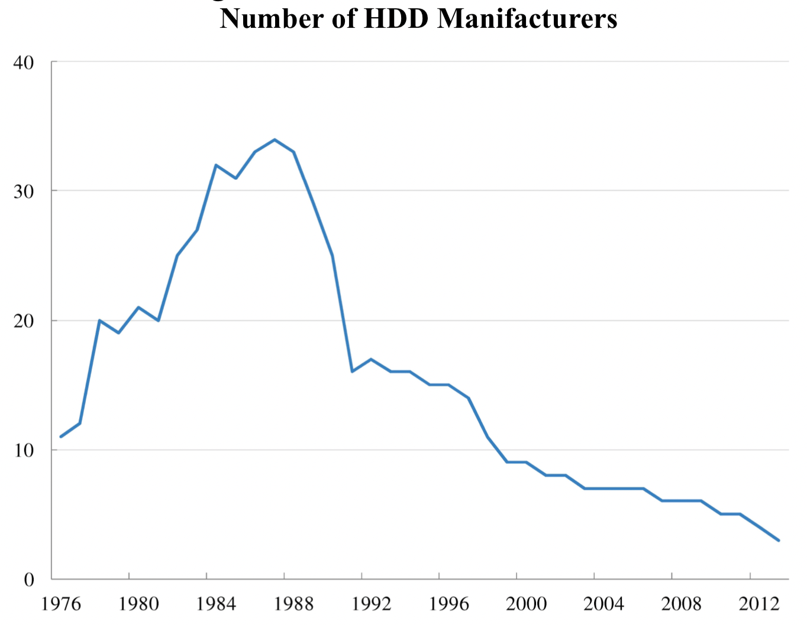{width=50%}

### Motivating Evidence (2)

Consolidation or exit?

- In the 80/90s mostly exit
- Then mergers

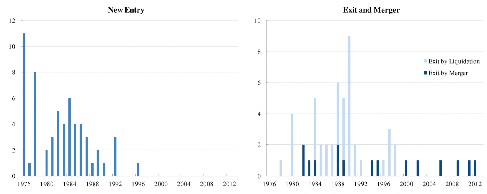{width=90%}

### Steps

- Estimate **demand** $(\alpha_0, \alpha_1, \alpha_2)$
  - Log-linear specification: $\log Q_{t}=\alpha_{0}+\alpha_{1} \log P_{t}+\alpha_{2} \log X_{t}+\varepsilon_{t}$
  - IV $Z_t$: input cost, disk price
- Compute marginal costs $mc_{it}$
  - Cournot competition
  - Invert the first-order condition and back out marginal costs: $mc_{it} = p_{it} + \frac{\partial p}{\partial q} q_{it}$ 
- Estimate **sunk costs** $(\kappa^i, \kappa^m, \kappa^e)$
  - @keane1997career kind of routine
    - Pick a parameter value
    - Solve the game by backward induction
    - Compute CCPs
    - Compute likelihood
  - Estimate parameter by maximum likelihood

### FAQ

- **State space**?
  - Marginal cost of firms
  - As if in the first step we are estimating the state space
  - Only in the second step we have the dynamics
- How to deal with the **sequential moves**?
  - Split the time frame into sufficiently granular time spans
  - So that there is never 2 actions occurring at the same time
- How to deal with **periods where nothing happens**?
  - Could be that nobody moves
  - Or some mergers are tried and failed
- **Bargaining power**?
  - Mergers ar erare events: sensitivity analysis

### Results (1): Model Fit

Model fits data reasonably well

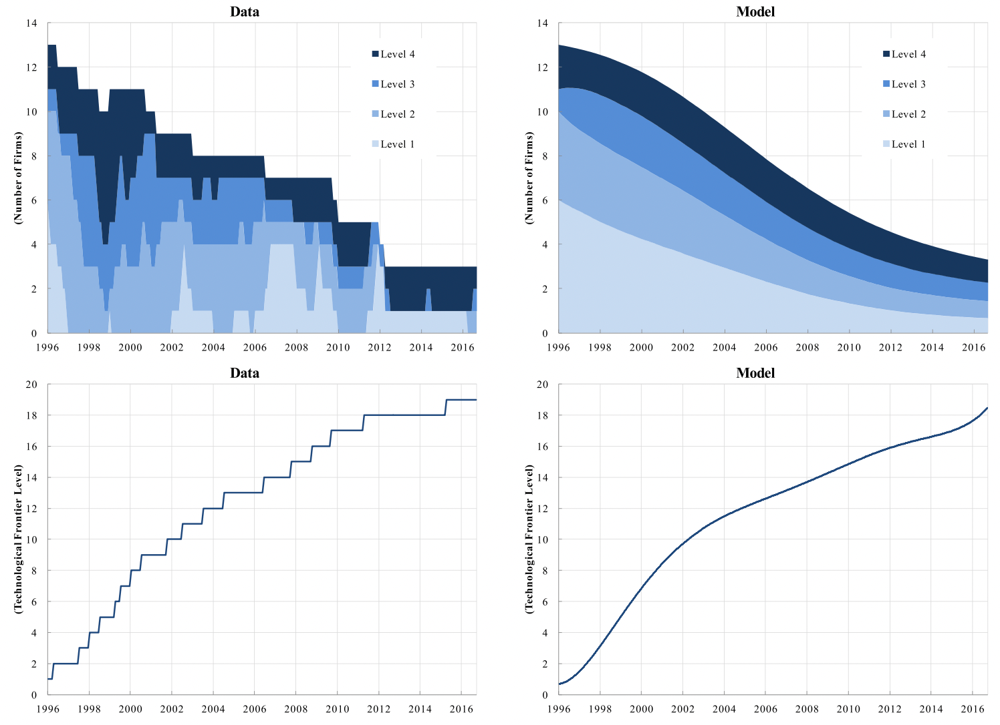{width=60%}

### Results (2): Mergers and Innovation

What is the estimated **innovation** curve?

- Plateau: increasing concave returns from innnovation in the number of (identical) firms

**Merger** incentives?

- U-shaped: as concentration increases, outside option of merging parties increse

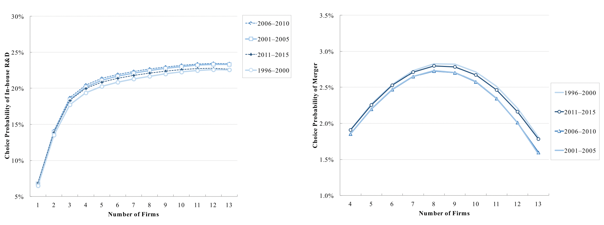{width=90%}

### Policy

What is the optimal number of firms? Definitely not 1.

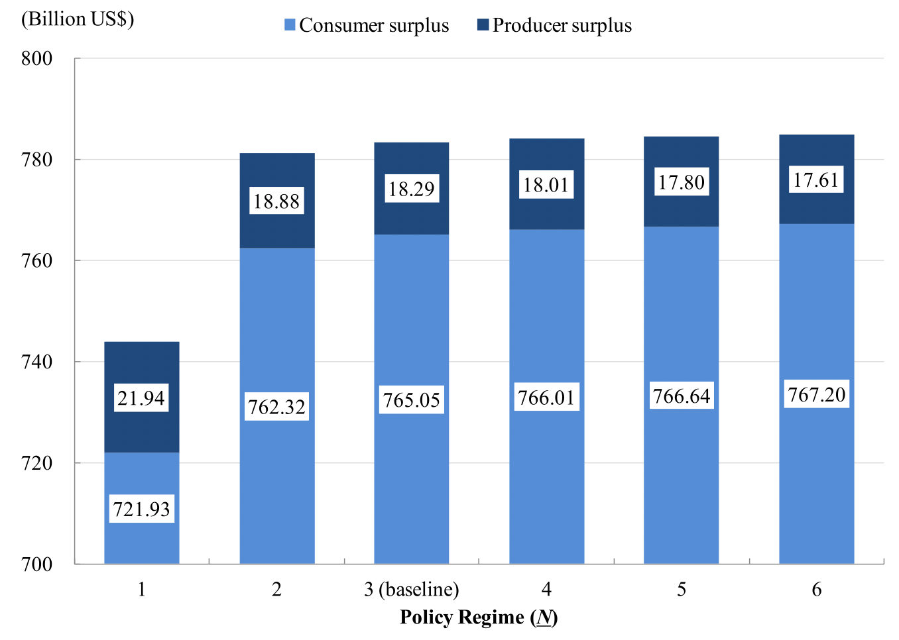{width=70%}

## Igami, Sugaya (2021)

### Literature

- @porter1983study
  - Railroad cartel before the Sherman Act: legal
  - Firms were keeping records of cartel activity
- @green1984noncooperative
  - Theory: including demand uncertainty
- @ellison1994theories
  - Why cartels break down at the top of the business cycle?
    - You expect there to be a downturn in the future 
    - Low future continuation value
    - Higher incentives to cheat
- @asker2010study
  - Bid rigging cartel of stamp dealers
- @igami2021measuring
  - Dynamic model of cartel survival

### Setting

**Problem** of cartel papers: **variation** in markets

- Usually 1 cartel in 1 market $\to$ no variation for estimation

Vitamin cartel

- one of the biggest cartels in history
- affected a lot of different vitamins
- each vitamin is a separate market
- also, different cartels for different vitamins
  - broke at different points in time (endogenously, no antitrust action)
  - **research question**: why?
- a lot of insider information on the cartels

### Research Question

Why did some cartels survive for a decade while others collapsed after only a few years?

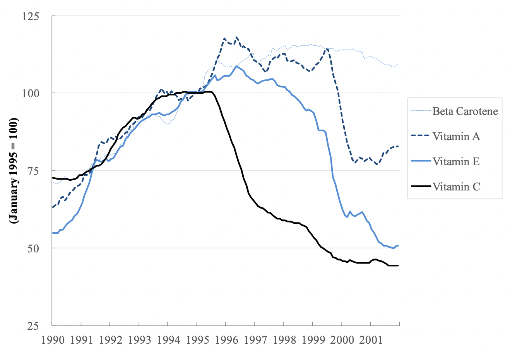{width=60%}

How do mergers affect the incentive to collude?

### Bernheim Report

- [Bates White witness report (2002)](https://appliedantitrust.com/04_private_actions/damages/vitamin_c/vitamin_c_edny_bernheim_report11_14_2008.pdf)
- On behalf of 4000+ vitamin buyers claiming damages from the cartel
- Involved in jury trial and made public in 2003
- Contains price and cost information for La Roche

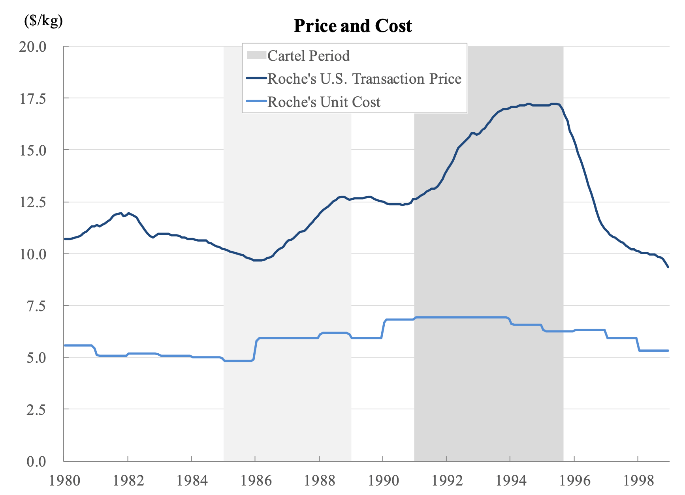{width=50%}

### Vitamins

**Product**: vitamins

- Geographically is a global market
- But each vitamin constitute a separate market
- Homogeneous good

**Demand**

- General health benefits, but no clear scientific evidence (on humans)
- Generally 9000+ purchasers of vitamins
  - Who? Farmers, cooperatives, .... Coca cola has 2.14% marekt share

**Supply**

- Market dominated by european big3: Roche, BASF, RP

### The Cartel (1): History 

**History**

- 1989: price war
- June 7 1989 in Basel, BASF and la Roche start talk
- August 1989, Zurich: RP joins the talks

**Design**

- For vitamins A and B
- Foresee demand growth
- Split it according to pre-1989  market shares
- Quarterly meetings to monitor the cartel performance

**Cartel expansion**

- 1990 and 1991: added new members

### The Cartel (2): Structure

**Monitoring**: almost perfect

- Self-reported sales data
- They were using government trade statistics to verify self-reports
  - Published with a time lag

**Punishment**

- Threat of reversion to competitive prices
- EC report (2003)
  - Takeda was often not complying with the agreement
  - “*the three European producers presented Takeda with an ultimatum unless it agreed to cut back its vitamin C sales, they would withdraw from the agreement*” (p. 44)

Other collusion-relevant info

- No multi-market contact
- No complicated punishment strategies, like carrot-stick
- No proce wars as part of the equilibrium (a la @green1984noncooperative)

### The Cartel (3): End

- 6 **natural deaths**
  - Entry of foreign suppliers
- 10 forced terminations
  - RP applied for Corporative Leniency Program
  - One of the first major cartel cases to make use of this instrument
  - Roche and BASF pleaded guilty
- **Mergers**
  - RP merged with Hoechst $\to$ Aventis (1998)
  - BASF acquired Takeda (2001)

### Model

Demand: linear
$$
Q_{t}^{D}=\alpha_{0}+\alpha_{1} P_{t}+\alpha_{2} X_{t}+\varepsilon_{t}
$$
Fringe supply

- Preferred specification: constant fraction of total quantity: $Q_{t}^{D}=Q_{c a r, t}+Q_{f r i, t}$

Supply: Cournot. With **FOC**
$$
P_{t}+\frac{d P}{d Q_{t}} \times q_{i, t}=c_{\text {roche }, t}^{\text {obs }}+\gamma_{i}+\eta_{i, t}
$$
Different **profit functions** 

1. Cartel: all collude
2. Deviation: all collude a part for the deviator that best responds
3. Competition: all best respond

### Estimation

GMM function with three moment conditions

- Independence of demand shock and supply cost shifter
  $$
  \bar{m}_{1}(\theta)=\sum_{y} \bar{\varepsilon}_{y} \cdot Z_{y}
  $$
  

- Independence of supply shock and demand shifter
  $$
  \bar{m}_{2, i}(\theta)=\sum_{y} \bar{\eta}_{i, y} \cdot W_{i, y}
  $$
  

- Independence between controls and demand error term
  $$
  \bar{m}_{3}(\theta)=\sum_{t} \bar{\eta}_{t} \cdot X_{t}
  $$
  

### Incentive Compatibility (1)

Value of complying
$$
V_{i, \tau \mid t}^{C}=\sum_{s \geq \tau} \beta^{s-\tau} \pi_{i, s \mid t}^{C}
$$
Value of not complying
$$
V_{i, \tau \mid t}^{D}=\sum_{s=\tau}^{\tau+2} \beta^{s-\tau} \pi_{i, s \mid t}^{D}+\sum_{s \geq \tau+3} \beta^{s-\tau} \pi_{i, s \mid t}^{N}
$$
ICC
$$
\min _{i \in I, \tau \geq t}\left(V_{i, \tau \mid t}^{C}-V_{i, \tau \mid t}^{D}\right) \geq 0
$$
How to **compute** it? We need expectation of

- Future **market size**
- Future size of the **supply fringe**

### Incentive Compatibility (2): Computation

**Demand**: market size

- Assume perfect foresight
- Also pretty stable

**Supply**: size of the supply fringe

- Series of shocks in the 90s
  - Bew method invented
  - Bosnian war 1992-95
  - Deng's '92 speech
- All unforeseen shocks
- Firms project current level of fringe output to the future

### Incentive Compatibility (2): Results

We can plot the firm incentives $V_{i, \tau \mid t}^{C}-V_{i, \tau \mid t}^{D}$ for each firm.

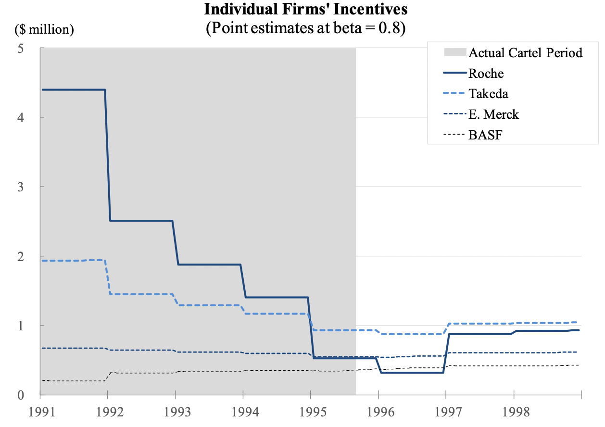{width=50%}

As fringe enters the market, incentives drop.

### Counterfactuals (1)

Who killed the vitamin cartel? Explore different combinations of

1. **Fringe** stopped growing after 1994 
2. **Demand** did not slow down because of the 1990's shocks

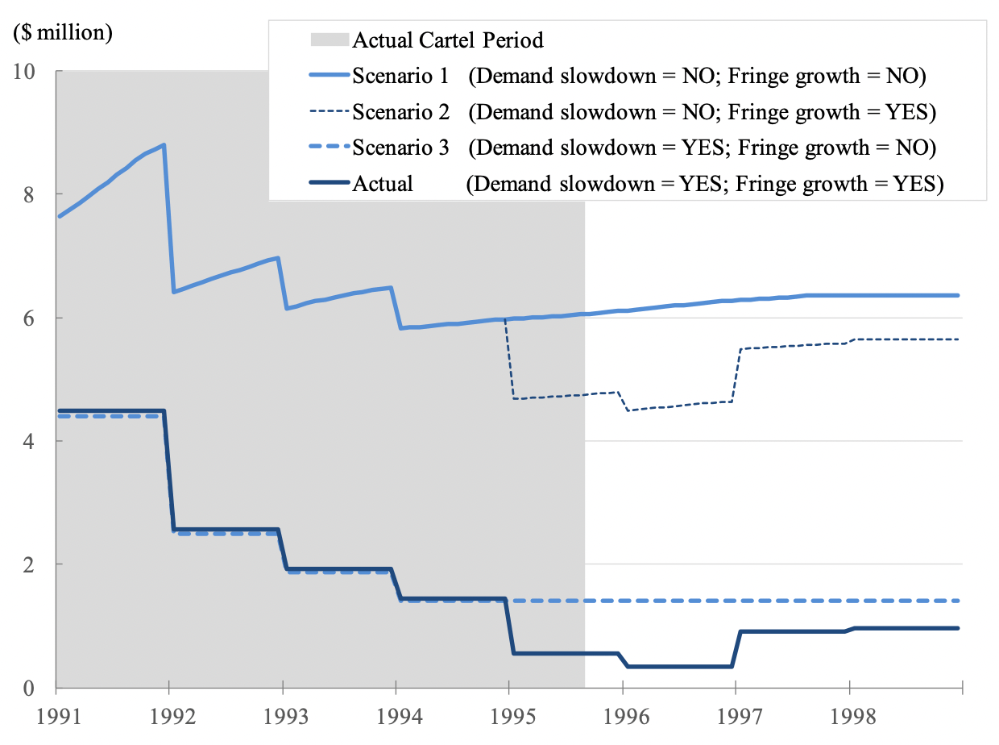{width=50%}

### Counterfactuals (2)

Could the **BASF-Takeda** merger save the vitamin cartel?

- What if they had done it before?
- BASF gets the minimum marginal cost + some synergy
- No capacity constraints
- Same cartel quotas

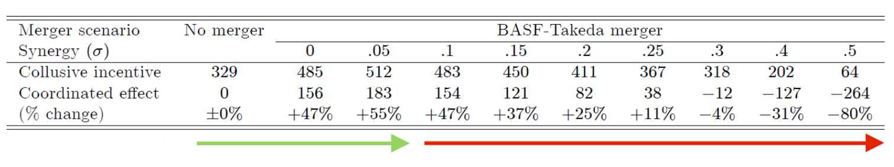{width=80%}

**Remark**: too many synergies make the cartel more asymmetric $\to$ less sustainable

### Counterfactuals (3)

Which merger would have helped the most?

- Simulate **Roche mergers** with different combinations of competittors

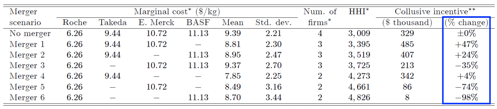{width=90%}

**Remark**: again, because of asymmetries, incentives do not monotonically increase with HHI

## References

------------------------------------------------------------------------
